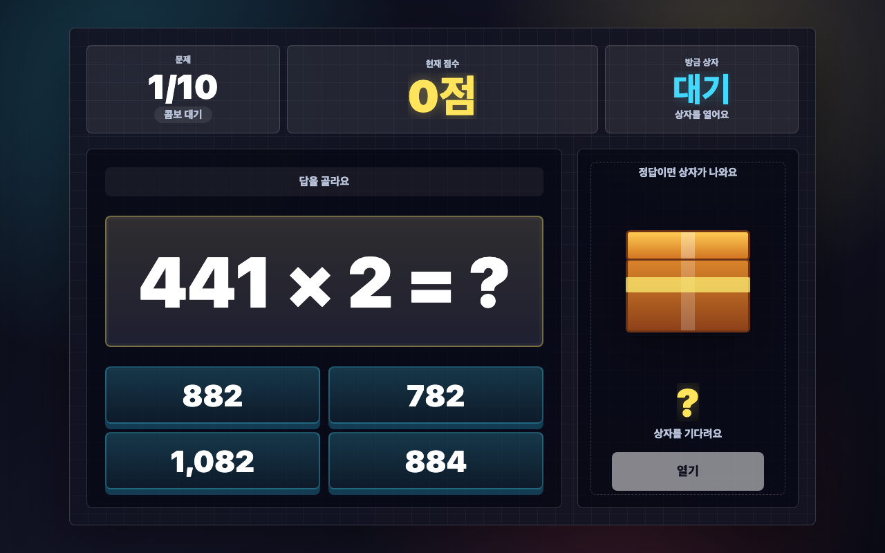
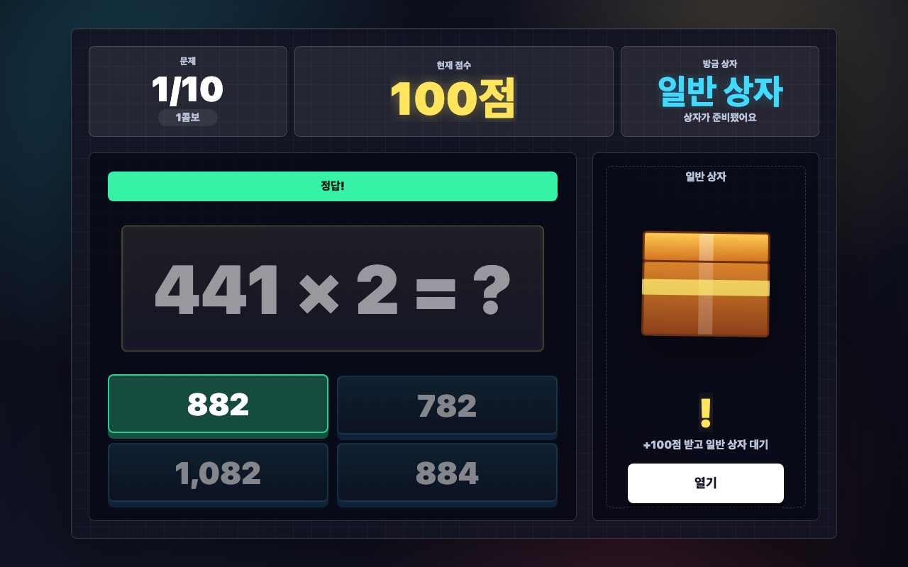
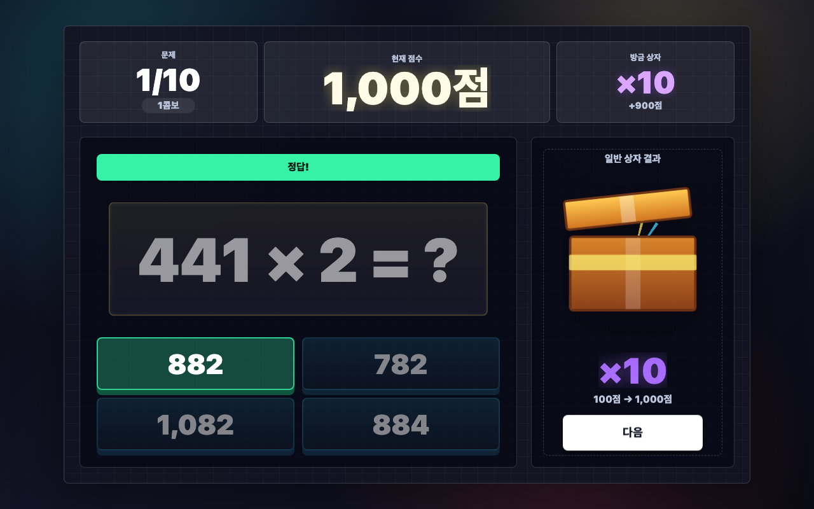
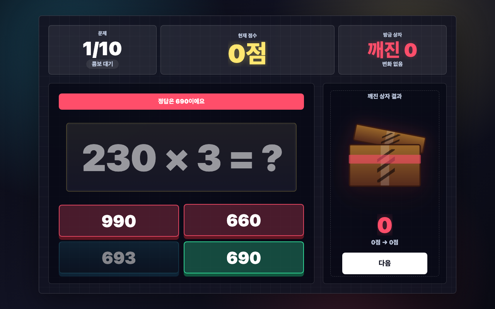
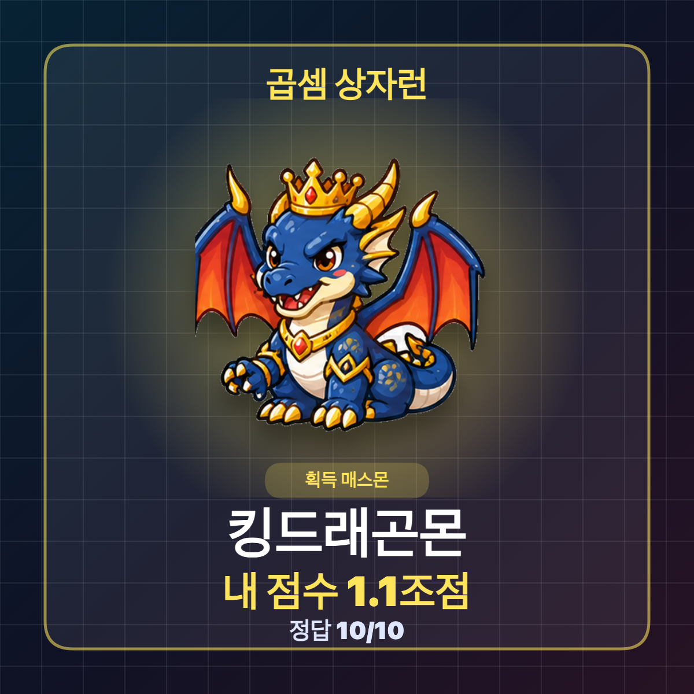
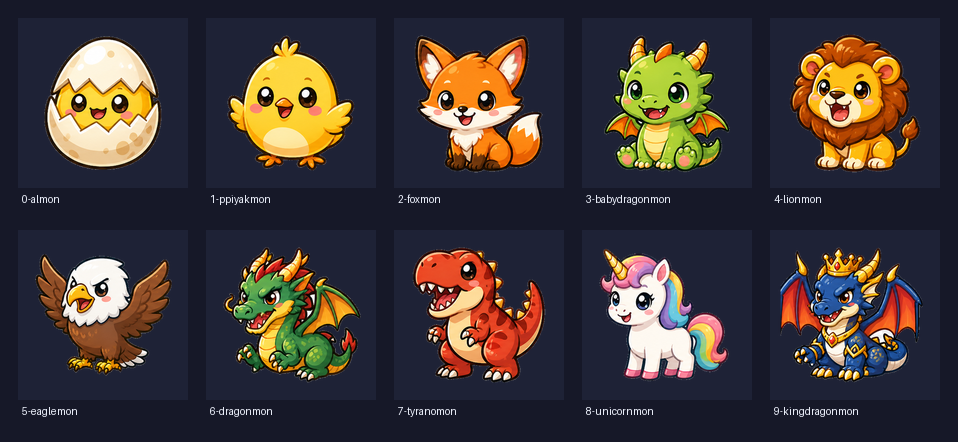

# 매스몬 상자런 설명 보고서

## 1. 개요

`매스몬 상자런`은 3학년 2학기 1단원에서 다루는 세 자리 수 × 한 자리 수 계산을 짧고 반복적인 게임 흐름으로 연습하는 에듀잇티 수학 게임입니다. 학생은 문제를 맞히면 상자를 열고, 상자 안의 보상으로 점수가 크게 오르거나 내려갑니다. 최종 점수와 정답 수에 따라 서로 다른 매스몬을 얻습니다.

핵심 목표는 단순 계산 반복을 `한 문제만 더` 풀고 싶게 만드는 것입니다.

## 2. 학습 설계

- 문제 유형: 받아올림 없는 세 자리 수 × 한 자리 수
- 문제 은행: 조건을 만족하는 186개 후보에서 매 판 10문제 랜덤 추출
- 라운드 길이: 10문제
- 입력 방식: 4지선다 선택
- 콤보 점수: 연속 정답이면 기본 정답 점수가 `+100`부터 `+500`까지 커짐
- 정답 보상: 일반, 반짝, 황금 상자 중 하나 열기
- 오답 처리: 1회 오답은 재도전, 2회 오답은 깨진 상자 자동 열기
- 결과 칭찬: 정답 수와 점수에 따라 한 줄 칭찬 표시
- 소리 피드백: 낮은 볼륨의 기존 BGM과 Kenney CC0 샘플 기반 정답, 오답, 상자, 보상, 결과 효과음 제공. 소리 버튼으로 함께 켜고 끔
- 최종 보상: 점수와 정답 수 조건을 함께 통과한 매스몬 획득

문제는 각 자리 숫자와 곱하는 수를 조합할 때 자리별 곱이 9를 넘지 않도록 만들어 받아올림이 생기지 않게 구성했습니다. 후보 문제는 총 186개이며, 한 판이 시작될 때 섞은 뒤 10개만 뽑아 반복 플레이마다 다른 문제 흐름이 나오게 했습니다.

### 교육적 의도

이 게임에서 곱셈 문제는 그 자체로 끝나는 반복 과제가 아니라, 점수 변화와 매스몬 획득으로 이어지는 `행동의 도구`입니다. 학생은 문제를 맞혀야 상자를 열 수 있고, 상자 결과에 따라 점수가 크게 오르거나 내려갑니다. 계산은 예측 가능한 영역이지만 보상은 예측 불가능하게 설계되어 있어, 학생은 같은 유형의 문제를 풀면서도 매번 다른 결과를 경험합니다.

교육적으로는 반복 연습에 게임의 간헐적 보상을 결합한 구조입니다. 학생은 단순히 정답을 맞히는 데서 멈추지 않고, 다음 상자와 최종 매스몬을 기대하며 더 많은 문제에 자발적으로 접근합니다. 이때 무작위성은 계산 학습을 흐리는 장치가 아니라, 이미 배운 계산 절차를 더 자주 사용하게 만드는 동기 장치로 작동합니다. 결과적으로 학생은 점수와 보상이라는 외적 목표를 따라가면서도, 실제로는 받아올림 없는 세 자리 수 곱셈의 자리별 계산 과정을 반복적으로 확인하고 숙달하게 됩니다.

## 3. 게임 흐름

```text
첫 화면 -> 설명 화면 -> 문제 풀이 -> 상자 보상 -> 다음 문제 -> 최종 매스몬
```

정답을 맞히면 콤보 점수를 받고 색깔 상자가 준비됩니다. 연속으로 맞힐수록 기본 정답 점수가 `+100`, `+200`, `+300`, `+400`, `+500`까지 커집니다. 정답 상자는 일반, 반짝, 황금 3단계이며 황금 상자일수록 좋은 보상 확률이 조금 더 높습니다. 상자에서는 `+`, `-`, `×`, `÷`, `0`, `-를 +로` 같은 효과가 한 번 적용됩니다. 점수는 음수와 큰 수를 모두 허용합니다. 결과 화면에서는 정답 수와 점수에 맞춘 짧은 칭찬 문장을 함께 보여 줍니다.

2번 틀리면 상자를 피할 수 없도록 깨진 상자가 자동으로 열립니다. 깨진 상자는 일반 상자보다 불리한 보상 풀이 적용되어, 일부러 틀려 위험을 피하는 전략을 막습니다.

## 4. 화면별 설명

### 첫 화면


첫 화면은 이미지 생성으로 만든 대표 커버를 사용합니다. 게임 제목, 매스몬, 상자, 배움 주제, 시작 버튼을 한 장면 안에 넣어 학생이 들어오자마자 `어떤 게임인지` 바로 느끼게 했습니다. 실제 조작은 이미지 위의 `시작` 버튼 위치에 투명 HTML 버튼을 얹어 처리하므로, 화면은 그림처럼 보이지만 클릭과 접근성은 유지됩니다.

### 설명 화면


학생이 읽기 쉬운 세 단계로 규칙을 보여 줍니다. 핵심은 문제를 풀고, 정답이면 상자를 열고, 두 번 틀리면 깨진 상자가 열린다는 점입니다.

### 문제 화면



문제와 선택지가 가장 크게 보이도록 구성했습니다. 상단에는 문제 진행도, 현재 점수, 방금 상자 결과가 표시됩니다.

### 정답 후 상자 대기



정답을 맞히면 문제 카드가 살짝 작아지고 상자가 강조됩니다. 학생은 `열기` 버튼을 눌러 보상을 확인합니다.

### 일반 상자 결과



상자가 열리면 효과가 크게 표시되고 점수가 즉시 바뀝니다. 큰 숫자 변화가 게임의 핵심 자극입니다.

### 깨진 상자 대기



2번 틀리면 정답을 보여 주고 모든 선택지를 잠급니다. 상자는 어둡게 변하고 균열이 생긴 뒤 자동으로 열립니다.

### 깨진 상자 결과


깨진 상자는 `-500`, `-5000`, `÷2`, `0`, 가끔 `+100` 중 하나가 나옵니다. 학생이 일부러 틀려 상자 위험을 피하는 편법을 막는 장치입니다.

### 최종 결과


최종 결과는 이미지 생성으로 만든 RasterStage 시상식 무대를 배경으로 사용합니다. 무대를 왼쪽으로 치우치게 두고 매스몬을 그 무대 중앙에 올린 뒤, 최종 점수, 칭찬 문구, 획득 매스몬 설명, 정답 수, 이미지 받기, 다시 버튼은 HTML로 올려 매 판 달라지는 결과값이 정확하게 보이도록 했습니다. 매스몬은 점수만이 아니라 정답 수 조건도 함께 봅니다.

### 이미지 받기



학생은 자신이 얻은 매스몬 이미지를 받을 수 있습니다. 다운로드 이미지에는 매스몬, 내 점수, 정답 수가 함께 들어갑니다.

## 5. 매스몬 설명



| 단계 | 매스몬 | 점수 조건 | 정답 수 조건 | 설명 |
| --- | --- | ---: | ---: | --- |
| 1 | 알몬 | 0점 이상 | 0개 이상 | 작지만 반짝이는 시작 매스몬입니다. |
| 2 | 삐약몬 | 500점 이상 | 2개 이상 | 톡톡 뛰는 계산 감각을 가진 매스몬입니다. |
| 3 | 여우몬 | 5,000점 이상 | 4개 이상 | 빠른 눈으로 정답을 찾는 매스몬입니다. |
| 4 | 새끼용몬 | 50,000점 이상 | 5개 이상 | 상자 운을 타고 날아오른 매스몬입니다. |
| 5 | 사자몬 | 500,000점 이상 | 6개 이상 | 큰 점수를 지키는 당당한 매스몬입니다. |
| 6 | 독수리몬 | 5,000,000점 이상 | 7개 이상 | 높은 점수 위를 시원하게 나는 매스몬입니다. |
| 7 | 드래곤몬 | 50,000,000점 이상 | 8개 이상 | 곱셈 상자를 뜨겁게 여는 매스몬입니다. |
| 8 | 티라노몬 | 500,000,000점 이상 | 8개 이상 | 엄청난 점수도 씩씩하게 삼키는 매스몬입니다. |
| 9 | 유니콘몬 | 5,000,000,000점 이상 | 9개 이상 | 반짝이는 행운을 몰고 온 매스몬입니다. |
| 10 | 킹드래곤몬 | 50,000,000,000점 이상 | 10개 | 이번 판의 전설급 상자런 매스몬입니다. |

## 6. 편법 방지 규칙

초반에 점수를 크게 얻은 뒤 일부러 틀려 상자를 피하는 전략을 막기 위해 두 가지 규칙을 넣었습니다.

- 모든 문제는 상자로 끝납니다. 정답이면 일반 상자, 2회 오답이면 깨진 상자가 열립니다.
- 매스몬은 점수만 보지 않고 정답 수 조건도 함께 봅니다.

예를 들어 10만점 이상을 얻어도 정답 수가 1/10이면 알몬만 얻습니다. 반대로 10/10을 맞히고 높은 점수까지 얻으면 킹드래곤몬까지 도달할 수 있습니다.

## 7. 공개 패키지 구성

이 폴더는 별도 빌드 없이 바로 열 수 있는 정적 패키지입니다.

- `index.html`
- `cover-generated.webp`
- `result-generated-v2.webp`
- `eduitit-logo-mark.png`
- `assets/audio/*.wav`
- `mathmon-0-almon.png` ~ `mathmon-9-kingdragonmon.png`
- `screenshots/*.png`
- `README.md`
- `REPORT.md`

브라우저에서 `index.html`을 열면 바로 실행됩니다.

효과음은 `_shared/audio/kenney/`에 출처와 카탈로그를 남긴 Kenney CC0 샘플 중 이 차시에서 참조하는 파일만 `assets/audio/`에 복사했습니다. 사용 팩은 Interface Sounds, Impact Sounds, RPG Audio, Digital Audio, Music Jingles입니다. 자산 일치와 길이 검사는 루트에서 `node scripts/check-audio-assets.mjs`로 확인합니다.
