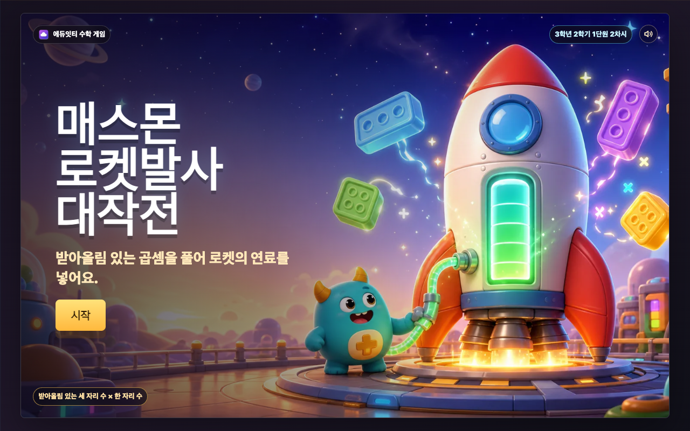
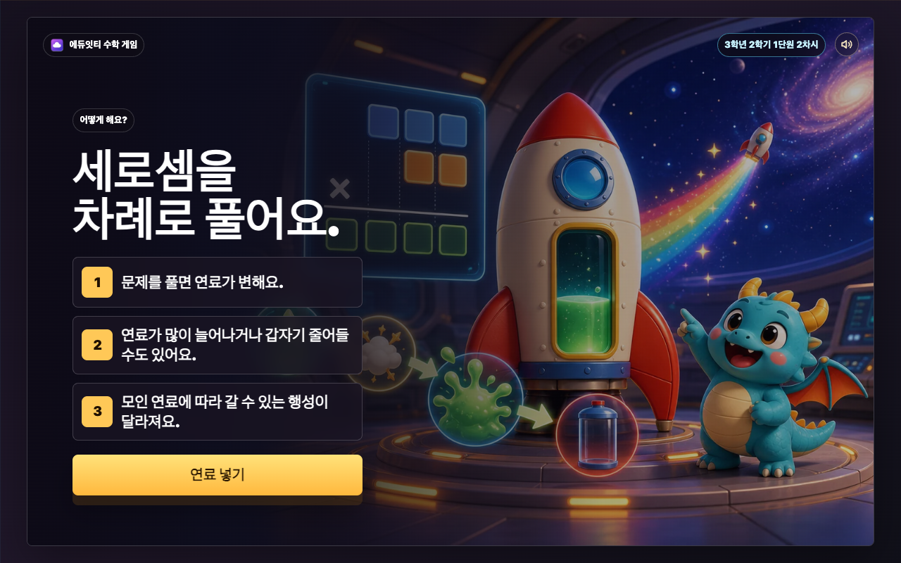
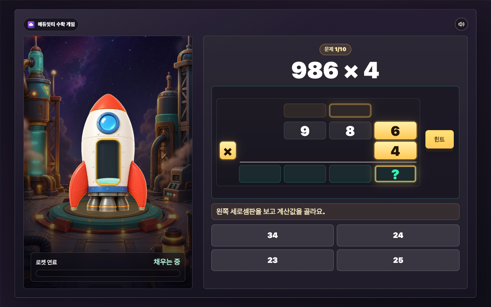
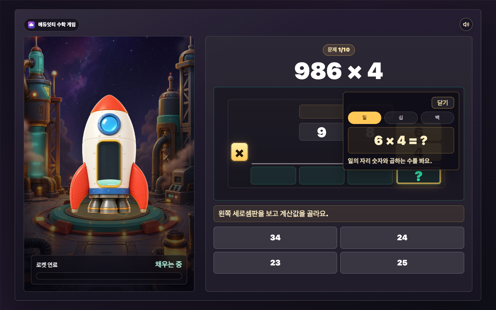
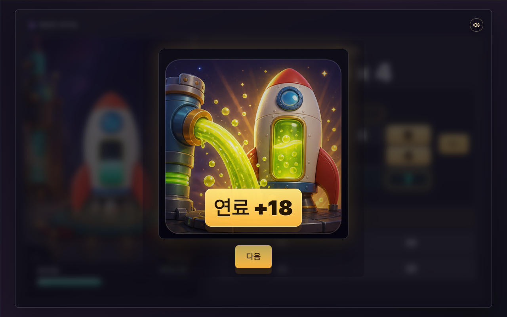
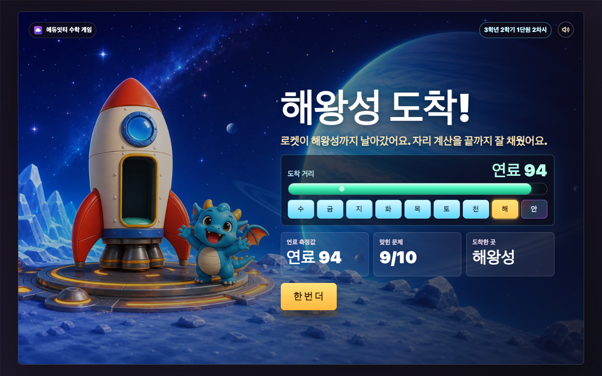
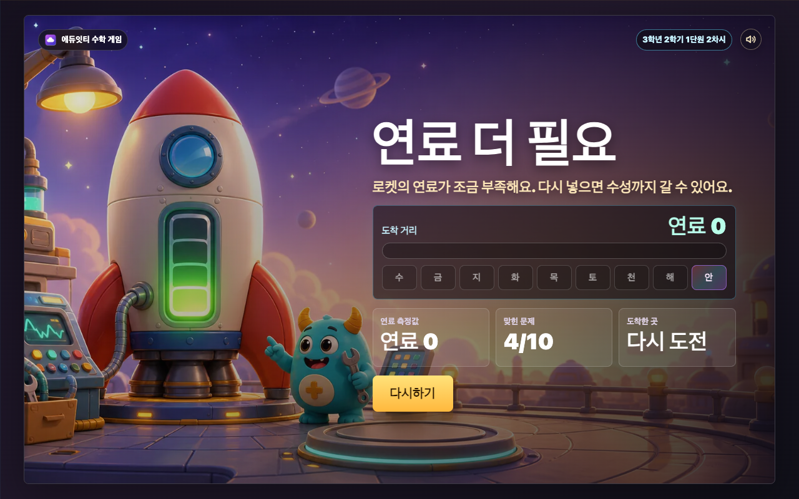

# 매스몬 로켓발사 대작전 설명 보고서

## 1. 개요

`매스몬 로켓발사 대작전`은 3학년 2학기 1단원에서 다루는 받아올림 있는 세 자리 수 × 한 자리 수 계산을 짧은 게임 흐름으로 연습하는 에듀잇티 수학 게임입니다. 학생은 세로셈판에서 일의 자리, 십의 자리, 백의 자리 계산값을 차례로 고르고, 한 문제를 끝낼 때마다 로켓의 연료 이벤트를 확인합니다.

핵심 목표는 곱셈 계산에서 `작은 자리부터 계산하고, 올림 수를 다음 자리에 더하는 과정`을 자연스럽게 반복하게 만드는 것입니다.

## 2. 학습 설계

- 문제 유형: 받아올림 있는 세 자리 수 × 한 자리 수
- 문제 은행: 자리올림이 1번 이상 생기는 후보에서 매 판 10문제 랜덤 추출
- 라운드 길이: 10문제
- 입력 방식: 세로셈판에서 일 -> 십 -> 백 순서로 자리별 계산값 4지선다 선택
- 피드백: 틀리면 해당 자리 계산 힌트를 한 번 주고, 두 번째에는 계산값과 세로셈 칸을 보여 준 뒤 다음 자리로 이동
- 보상: 한 문제 완료마다 연료 이벤트를 1회 적용. 정답 문제는 normal, smallExplosion, megaFuel, instantLaunch, emptyTank, rainbowFuel 중 하나가 나오고, 오답이 있었던 문제는 leak만 적용
- 행성 단계: 연료 1~100을 측정해 수성 -> 금성 -> 지구 -> 화성 -> 목성 -> 토성 -> 천왕성 -> 해왕성 순서 중 도착 가능 행성을 공개
- 비밀 단계: 무지개 연료를 한 번 얻으면 일반 연료량보다 안드로메다 도착이 우선
- 난이도 조정: 정답 10개를 모두 맞혀도 평균적으로는 중간 행성권에 머물고, 해왕성은 어려운 최상위 목표, 안드로메다는 해왕성보다 더 보기 힘든 secret stage로 설계
- 결과 분기: 즉시 발사 이벤트 또는 10문제 종료 시 결과 화면으로 이동. 연료가 0이면 로켓 점검 화면에서 다시하기
- 최종 보상: 로켓이 도착한 장소를 주 보상으로 보여 주고, 매스몬은 동행 주인공으로 장면 안에 등장

### 교육적 의도

받아올림 있는 곱셈은 답만 맞히는 연습으로 끝나면 학생이 어느 자리에서 실수했는지 흐려지기 쉽습니다. 이 게임은 세로셈판을 화면 중앙에 두고, 학생이 일의 자리부터 차례대로 계산값을 고르게 합니다. 올림 수는 학생이 암호처럼 맞히는 대상이 아니라, 계산 결과가 칸에 들어가며 자연스럽게 보이는 학습 피드백입니다.

로켓 연료는 단일 중심 보상입니다. 학생에게는 원점수를 보이지 않고 `로켓 안에 연료가 얼마나 찼는가`만 보이게 하며, 마지막에 그 연료를 측정해 도착 가능 행성을 공개합니다. 행성 단계는 수성, 금성, 지구, 화성, 목성, 토성, 천왕성, 해왕성 순서로 보여 줍니다. 다만 무지개 연료를 얻은 판은 secret stage로 안드로메다 도착을 보여 줍니다. 매스몬은 별도 획득 보상이 아니라 첫 화면부터 함께 나오는 동행 주인공입니다. 결과 화면은 도착지별 배경 9장과 다시하기 배경을 사용해, 도착한 장소가 바로 보이게 합니다.

## 3. 게임 흐름

```text
첫 화면 -> 설명 화면 -> 일의 자리 계산 -> 십의 자리 계산 -> 백의 자리 계산 -> 연료 이벤트 -> 다음 문제 또는 즉시 발사 -> 연료 측정 연출 -> 도착 행성/안드로메다/다시하기 결과 -> 순위 보기
```

학생은 먼저 일의 자리 계산값을 고릅니다. 예를 들어 850 × 3에서는 `0 × 3 = 0`을 골라 일의 자리 칸을 채웁니다. 다음에는 `5 × 3 + 0 = 15`를 골라 십의 자리에는 5를 쓰고 백의 자리로 1을 올립니다. 마지막으로 `8 × 3 + 1 = 25`를 고르면 2550이 완성되고 연료 이벤트가 일어납니다.

## 4. 화면별 설명

아래 스크린샷은 현재 로컬 실행 화면 기준입니다. GitHub에서 `REPORT.md`를 열면 각 화면의 실제 구성을 바로 확인할 수 있습니다.

게임은 태블릿 가로 화면과 컴퓨터 화면을 기준으로 설계했습니다. 세로 화면에서는 `가로 화면에서 플레이해요` 안내를 먼저 보여 줍니다.

### 첫 화면

첫 화면은 `cover-generated.webp`를 RasterStage 배경으로 사용합니다. 로켓과 매스몬이 보이는 기존 대표 장면은 그대로 유지하고, 제목 부분은 GPT Image로 만든 독립 타이틀 아트(`title-poster-generated.webp`)로 얹었습니다. 시작 버튼은 1차시 포스터형 버튼 물성을 참고해 별도로 생성한 `start-button-generated.webp`로 보여 주고, 실제 클릭은 같은 크기의 HTML 버튼이 맡습니다. 한 줄 목표는 실제 화면에서 `받아올림 있는 곱셈을 풀어 로켓의 연료를 넣어요.`로 보여 줍니다.



### 설명 화면

설명 화면은 생성 이미지 포스터 한 장으로 규칙을 보여 줍니다. 세로셈판, 받아올림 표시, 로켓 연료 넣기 예시, `연료 넣기` 버튼 표면까지 이미지 안에 들어 있습니다. HTML은 숨김 접근성 설명과 투명 hitbox만 맡습니다.

설명 화면 문구는 다음만 보여 줍니다.

- 제목: 차례로 곱해요
- 1단계: 일의 자리부터 곱해요.
- 2단계: 받아올리면 위에 적어요.
- 3단계: 연료를 넣어요.

버튼 문구는 다음 행동이 바로 보이도록 `연료 넣기`로 둡니다.



### 문제 화면

문제 화면은 왼쪽에 로켓 연료 상태, 오른쪽에 세로셈판과 선택지를 둡니다. 로켓은 생성 이미지(`rocket-charge.webp`)를 사용하고, 뒤쪽에는 별하늘 발사장 생성 이미지(`rocket-launchpad-generated.webp`)를 깔았습니다. 왼쪽에는 `로켓 연료`, `채우는 중`, `행성 거리`, `마지막에 측정`처럼 현재 상태만 짧게 보여 줍니다. 큰 배터리 창 위에는 HTML/CSS 액체 레이어를 얹어 연료량에 따라 액체가 차오르게 했고, 같은 값을 발사장 전체에도 전달해 바닥 링, 증기, 신호등, 빛줄기 효과가 함께 강해지게 했습니다. 무지개 연료를 얻으면 연료 액체와 발사장 효과가 무지개빛으로 바뀝니다. 세로셈판은 일, 십, 백 순서로 현재 칸을 강조하고, 올림 수와 답 칸을 실제 계산 순서대로 채웁니다. 현재 계산에 쓰는 숫자, 곱하는 수, 올림 수, 답 칸을 세로셈판 안에서 직접 강조하고, 보조식은 기본으로 숨긴 뒤 학생이 `힌트`를 누를 때만 펼쳐지게 했습니다.





### 보상 화면

한 문제의 세 자리 계산이 끝나면 화면 중앙에 연료 이벤트 모달이 뜹니다. 모달은 긴 설명문 대신 `reward-events-sprite-generated.png`의 6개 이미지 칸을 사용합니다. 연료 주입, 대량 주입, 연료 감소, 연료 0, 즉시 발사, 무지개 연료를 이미지로 구분하고, 화면에는 `연료 +6`, `연료 -12`, `연료 0`, `발사!`, `무지개!`처럼 짧은 값만 HTML로 얹습니다. 문제 안에서 한 번이라도 틀리면 연료 감소 이미지가 나오고 연료가 줄어듭니다. 보상은 로켓 안 액체 연료 하나로만 적용됩니다. 문제 화면의 행성 트랙은 `마지막에 측정` 또는 `곧 측정` 상태로만 두고, 실제 도착 가능 행성은 마지막 측정 연출에서 공개합니다.

소리는 낮은 우주 BGM만 기존 WebAudio 루프로 유지하고, 효과음은 Kenney CC0 샘플 WAV로 재생합니다. 시작, 정답, 오답, 자리값 확인, 연료 이벤트, 측정, 결과 공개가 서로 다른 소리로 구분됩니다. 오른쪽 위 설정 버튼을 열면 `배경 소리`와 `효과 소리`를 따로 켜고 끌 수 있고, `방법 다시 보기`는 현재 문제 상태를 유지한 채 설명 화면을 복습 모드로 보여 줍니다. `처음부터`는 확인 뒤 첫 화면으로 돌아갑니다.



### 도착 결과 화면

도착 결과는 도착지별 RasterStage 배경 9장을 사용합니다. 수성부터 해왕성까지 8행성, 그리고 무지개 연료 secret stage인 안드로메다 배경이 따로 있습니다. 생성 이미지에는 텍스트, 점수, 버튼을 넣지 않고 로켓, 매스몬, 도착 장소만 담습니다. 그 위에 연료 측정 막대, 행성 거리 스캔, `연료 측정값`, `맞힌 문제`, `도착한 곳`, 도착 문구를 HTML로 얹습니다.



결과 화면의 `순위 보기` 버튼은 문제 풀이와 보상 흐름을 모두 끝낸 뒤에만 보입니다. 학생이 누르면 점수 제출과 주간 순위 조회를 시도합니다. API 주소가 없거나 연결에 실패해도 결과 화면 자체는 막지 않습니다.

### 다시하기 결과 화면

연료가 부족하면 `result-retry-generated.webp`를 RasterStage 배경으로 사용합니다. 로켓이 안전하게 점검되고 파란 매스몬 친구가 다시 해보자고 응원하는 장면 위에 다시 도전 문구와 `다시하기` 버튼을 보여 줍니다.



### 전국 순위 화면

순위 화면은 결과 뒤에 붙는 마지막 화면입니다. `_shared/scoreboard` 공통 화면을 사용하며, `scoreboard-celebration-bg-generated.webp`는 매스몬, 불꽃, 무대 조명만 담은 축하 배경입니다. 상단의 `전국 로켓 순위`는 `scoreboard-title-rocket-generated.webp` 생성형 타이틀 자산으로 보여 주고, 순위판, 내 기록 3칸, 순위 행, 버튼 표면, 동적으로 바뀌는 글자는 SVG `viewBox="0 0 1280 800"` 안에서 공통 컴포넌트가 그립니다. 더 이상 생성 이미지 안의 박스에 글자를 맞추지 않습니다. SVG `<text>`는 이름, 연료 점수, 내 등수, 이번 주 순위 목록, 버튼 라벨처럼 실제 값을 그리고, HTML 버튼은 보이지 않는 hitbox만 맡습니다. 학생이 직접 이름을 쓰는 칸은 없습니다. 상단 상태 문장은 제거했고, 순위 기능이 꺼져 있으면 순위 목록 영역 안에 안내만 보여 주며 게임 결과는 그대로 유지합니다.


### 업체 백엔드 구성 인계

전국 순위 기능은 정적 게임 파일과 분리된 별도 백엔드로 운영합니다. GitHub 저장소에는 백엔드 코드가 `scoreboard-api/` 폴더로 들어 있습니다. 업체는 이 폴더를 하나의 API 서비스로 배포하고, 게임 HTML에는 배포된 API 주소만 주입하면 됩니다.

백엔드가 맡는 일:

- 게임 시작 세션 생성
- 서버 승인 닉네임 생성
- 점수 제출 1회 제한
- answer log와 보상 이벤트 범위 검산
- 주간 전국 순위 조회
- 참가코드별 순위 조회
- 학생에게 공개하면 안 되는 값 제거

백엔드가 맡지 않는 일:

- 게임 HTML/이미지 서빙
- 학생 실명, 학교명, 지역명 저장
- 자유 닉네임 입력
- 교사 계정/관리자 화면 완성

GitHub 배포 기준:

```text
scoreboard-api/
  src/       API 서버 코드
  prisma/    PostgreSQL schema, seed, migration
  tests/     API와 검산 테스트
  docs/      API, Railway, 게임 연동, 개인정보 운영 문서
```

`node_modules/`, `dist/`, `.env`는 GitHub에 올리지 않습니다. `bun.lock`, `prisma/migrations/`, `.env.example`은 업체 재현을 위해 포함합니다.

Railway 기준 구성:

```text
Root Directory: scoreboard-api
Install Command: bun install --frozen-lockfile
Start Command: bun run start
```

필수 환경 변수:

```text
DATABASE_URL=PostgreSQL 연결 주소
FRONTEND_ORIGINS=https://게임이-올라간-도메인
ADMIN_TOKEN=충분히-긴-랜덤-문자열
RETENTION_ANSWER_LOG_DAYS=90
PORT=3000
```

첫 배포 전 DB 준비:

```bash
cd scoreboard-api
bun install
bun run prisma:generate
bun run prisma:deploy
bun run prisma:seed
```

배포 뒤 확인:

```bash
curl https://your-scoreboard-api.example.com/health
```

정상 응답은 `{ "status": "ok" }`입니다.

게임 쪽 연결은 API 주소 한 줄만 주입합니다.

```html
<script>
  window.MATHMON_SCOREBOARD_API_URL = "https://your-scoreboard-api.example.com";
</script>
```

API 주소가 없거나 실패해도 게임 완료는 막지 않습니다. 이 경우 결과 화면은 그대로 보이고, 순위 화면에는 순위 기능이 꺼졌다는 안내만 표시됩니다.

업체 공개 전 QA는 아래 순서로 확인합니다.

```text
1. /health 확인
2. POST /api/v1/sessions 성공 확인
3. 게임에서 결과 화면까지 플레이
4. 순위 보기 클릭
5. POST /api/v1/scores 201 확인
6. GET /api/v1/leaderboards/weekly 200 확인
7. 순위 화면에 서버 닉네임, 점수, 등수 표시 확인
8. API 주소를 비운 상태에서도 게임 결과가 막히지 않는지 확인
```

상세 문서는 `scoreboard-api/README.md`, `scoreboard-api/docs/API.md`, `scoreboard-api/docs/RAILWAY_DEPLOY.md`, `scoreboard-api/docs/GAME_INTEGRATION.md`, `scoreboard-api/docs/PRIVACY_AND_OPERATIONS.md`를 기준으로 합니다.

## 5. 매스몬 역할

2탄의 매스몬은 도감 보상이나 별도 획득 대상이 아닙니다. 첫 화면에 등장한 파란 매스몬 친구가 로켓에 연료를 넣는 일을 함께 돕고, 성공과 실패 결과 장면에서도 같은 친구로 이어집니다. 학생이 얻는 중심 보상은 `로켓 발사 성공`입니다.

## 6. 공개 패키지 구성

이 폴더는 별도 빌드 없이 바로 열 수 있는 정적 패키지입니다.

- `index.html`
- `cover-generated.webp`
- `title-poster-generated.webp`
- `start-button-source.png`, `start-button-generated.png`, `start-button-generated.webp`
- `tutorial-generated.webp`
- `tutorial-fulltext-source.png`, `tutorial-fulltext-generated.webp`
- `tutorial-solve-source.png`, `tutorial-solve-generated.webp`
- `tutorial-goal-source.png`, `tutorial-goal-generated.webp`
- `rocket-charge.webp`
- `reward-events-sprite-generated.png`
- `result-mercury-generated.webp`
- `result-venus-generated.webp`
- `result-earth-generated.webp`
- `result-mars-generated.webp`
- `result-jupiter-generated.webp`
- `result-saturn-generated.webp`
- `result-uranus-generated.webp`
- `result-neptune-generated.webp`
- `result-andromeda-generated.webp`
- `result-retry-generated.webp`
- `eduitit-logo-mark.png`
- `assets/mathmon/base-pack/*.webp`
- `assets/audio/*.wav`
- `screenshots/*.png`
- `README.md`
- `REPORT.md`

브라우저에서 `index.html`을 열면 바로 실행됩니다.

효과음은 `_shared/audio/kenney/`에 출처와 카탈로그를 남긴 Kenney CC0 샘플 중 이 차시에서 참조하는 파일만 `assets/audio/`에 복사했습니다. 사용 팩은 Interface Sounds, Sci-fi Sounds, Digital Audio, Music Jingles입니다. 자산 일치와 길이 검사는 루트에서 `node scripts/check-audio-assets.mjs`로 확인합니다.

## 7. 설정/소리 QA

설정 모달 문구는 `설정`, `배경 소리`, `효과 소리`, `방법 다시 보기`, `처음부터`, `처음부터 할까요?`, `계속하기`, `닫기`처럼 짧은 말만 사용했습니다. Humanizer 기준으로 번역투나 제작자 용어 없이 초3 학생이 바로 읽을 수 있는 말로 확인했습니다.

- 정적 검사: `node --check scripts/check-stage-ratio.mjs`, `node --check scripts/qa-mathmon-audio-smoke.mjs`, `node scripts/check-stage-ratio.mjs`, `node scripts/check-audio-assets.mjs`
- 브라우저 오디오/설정 QA: `node scripts/qa-mathmon-audio-smoke.mjs`
- 화면 QA: 1280x800, 1024x768에서 첫 화면, 설명, 문제 화면의 설정 버튼과 배지/HUD 충돌 0건을 확인했습니다. 설정 모달 텍스트 넘침 0건, 버튼 클릭 영역 충돌 0건을 확인했습니다.

## 8. 전국 순위 QA

순위 화면 문구는 Humanizer 기준으로 점검했습니다. 학생에게 보이는 말은 `순위 보기`, `전국 로켓 순위`, `내 이름`, `연료 점수`, `내 등수`, `10위까지`, `새로 보기`, `결과로`, `다시하기`처럼 짧게 유지했습니다. `서버`, `토큰`, `세션`, `검산` 같은 제작자 용어와 이름 정책 설명은 화면에 보이지 않습니다.

- 렌더러 QA: `MathmonScoreboard.render(...)`에 10행 모의 주간 순위를 넣어 success 상태를 확인했습니다. 기본 화면은 4행이 보이고, 순위판 안에서 스크롤하면 10위까지 같은 슬롯 안에서 보입니다.
- 상태 QA: API 꺼짐, loading, error, empty 상태가 같은 SVG 순위판 안의 안내 문구로 자연스럽게 표시되는 것을 확인했습니다.
- 순위 화면 위치 QA: 1280x800, 1024x768, 856x544 브라우저에서 확인했습니다. SVG `<text>` Stage 밖 이탈, 순위판 밖 이탈, 보이는 HTML 버튼 텍스트, `foreignObject`, 금지 문구, 요소 겹침 0건을 확인했습니다.
- 2026-07-02 추가 QA: `scoreboard-title-rocket-generated.webp` 생성형 타이틀 자산을 적용하고 1280x800, 1024x768, 856x544에서 타이틀 가독성, 배경 겹침, 상단 상태 문구 제거, 목록/버튼 위치를 다시 확인했습니다.
- 클릭 QA: `새로 보기`, `결과로`, `다시하기` 투명 hitbox가 각각 실제 클릭을 받는 것을 확인했습니다.
- 정적 검사: `_shared/scoreboard/scoreboard-ui.js` 문법 검사, HTML 인라인 스크립트 파싱, `node scripts/check-stage-ratio.mjs`, `git diff --check`를 통과했습니다.

## 9. 2026-07-02 설명 화면 2장 이관

설명 화면을 생성 이미지 2장 흐름으로 바꿨습니다. 첫 장은 `tutorial-solve-source.png`와 `tutorial-solve-generated.webp`가 맡고, 받아올림하며 곱하는 방법과 `다음` 버튼을 보여 줍니다. 둘째 장은 `tutorial-goal-source.png`와 `tutorial-goal-generated.webp`가 맡고, 문제를 맞히면 연료를 얻고 마지막에 전국 순위를 볼 수 있음을 알려 줍니다.

HTML은 보이는 설명을 다시 그리지 않고 접근성용 숨김 설명, 단계 전환 상태값, 투명 hitbox만 맡습니다. 첫 클릭은 `solve`에서 `goal`로 넘어가고, 둘째 클릭은 `발사 준비`로 첫 문제를 시작합니다. 설정의 `방법 다시 보기`도 같은 두 장을 보여 준 뒤 원래 화면으로 돌아옵니다.

학생 문구는 `일의 자리부터 곱해요.`, `받아올릴 수를 위에 적어요.`, `올린 수까지 더해 답을 만들어요.`, `발사 준비`처럼 짧은 행동 말로 유지했습니다. 로컬 Chrome QA에서 1280×800 기준 `시작 → 설명 1장 → 다음 → 설명 2장 → 발사 준비 → 문제 화면` 흐름을 확인했고, 설명 이미지 표시, 버튼 aria-label, Stage 비율, inline script 파싱, `git diff --check`를 통과했습니다.
