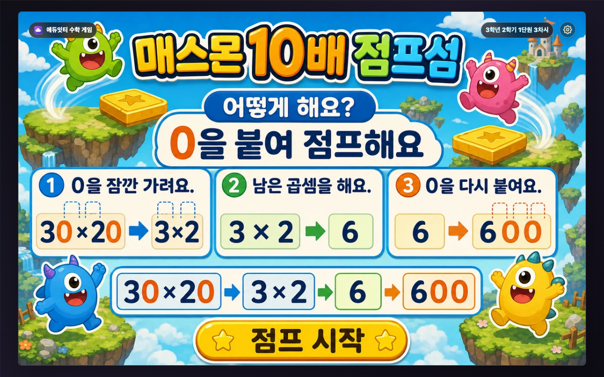
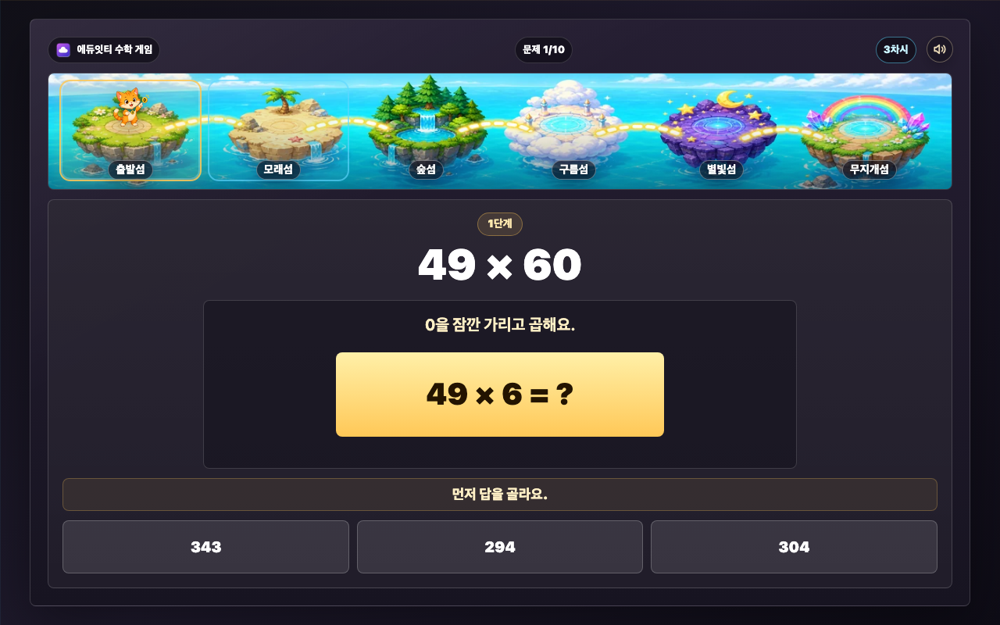
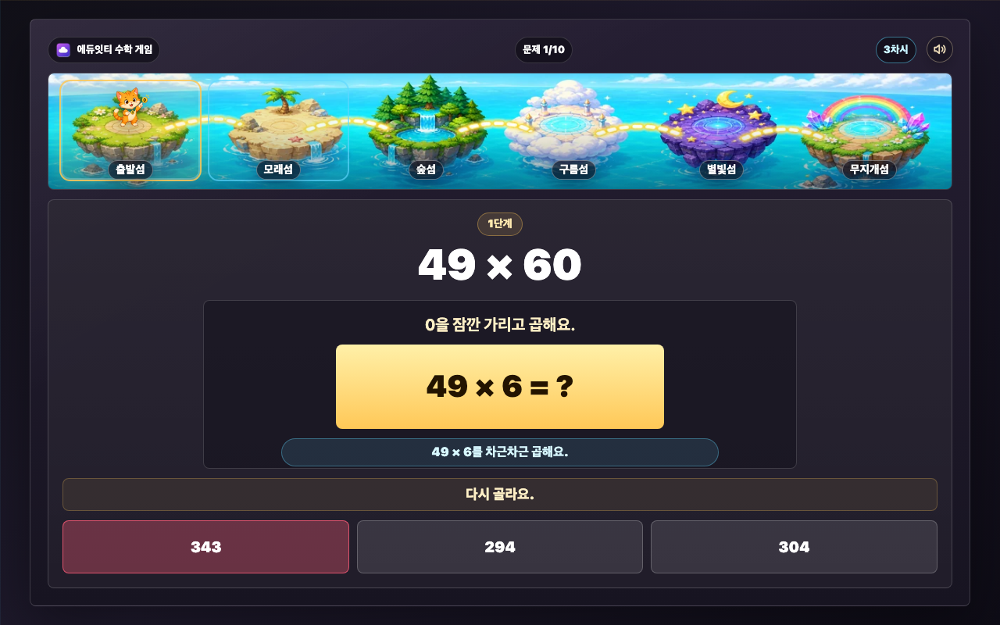
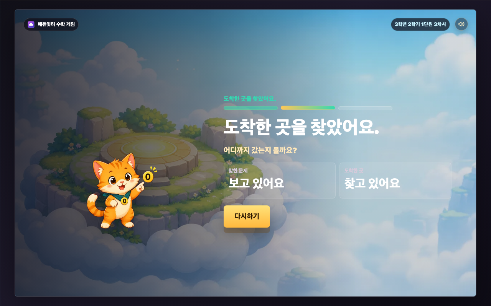
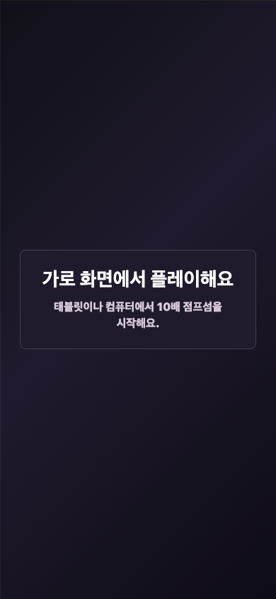

# 매스몬 10배 점프섬 REPORT

## 구현 요약

- 대상: 3학년 2학기 1단원 3차시 `(몇십)×(몇십), (몇십몇)×(몇십)`
- 실행 파일: `3-2-1-3-mathmon-jump-islands/index.html`
- Stage: `16:10`, `1280x800`, `.stage-shell` contain 구조
- 첫 화면: `cover-generated.webp` 배경, `title-poster-generated.webp` 제목 아트, HTML 목표 문장, 독립 생성형 `start-button-generated.webp` 버튼 아트와 실제 HTML 버튼
- 흐름: 첫 화면 → 설명 1(0 가리고 곱하기) → 설명 2(점프와 순위 목표) → 문제 → 바람 → 도착 전 살펴보기 → 결과 → 전국 순위

## 첫 화면과 설명

### 첫 화면

첫 화면은 왼쪽에 제목 아트, 목표 문장, 시작 버튼을 모으고 오른쪽에 섬 장면과 매스몬을 둡니다. 학생이 들어오자마자 `0을 잠깐 가리고 곱한 뒤 0을 붙여 섬을 건너는 게임`이라는 목표를 볼 수 있게 했습니다.

### 설명 화면

설명 화면은 생성 이미지 2장 흐름입니다. 첫 장 `tutorial-solve-generated.webp`는 0을 잠깐 가리고 곱한 뒤 다시 붙이는 방법을 보여 주고, 버튼은 `다음`입니다. 둘째 장 `tutorial-goal-generated.webp`는 10문제를 풀며 점프 힘과 바람을 얻고 마지막에 도착 섬과 전국 순위를 확인한다는 목표를 보여 줍니다. HTML은 숨김 접근성 설명, `data-tutorial-step`, 투명 hitbox만 맡고 보이는 설명 UI를 다시 그리지 않습니다.

## 문제 은행

`Lesson3MathModel.generateRun(seed)`가 실행 때 문제를 뽑습니다.

- 한 판 10문제
- `0 한 개 붙이기` 문제 5개, `0 두 개 붙이기` 문제 5개
- 최종 답 중복 없음
- `(A0)×(B0)`: `A×B`를 고른 뒤 `0 두 개 붙이기`
- `(AB)×(C0)`: `AB×C`를 고른 뒤 `0 한 개 붙이기`
- 화면 변환 예: 1단계 `49 × 6 = 294`, 2단계 `294 → 2,940`, 완성 칸 `49 × 60 = 2,940`

## 교육적 의도

이 차시에서 곱셈 문제는 섬을 건너기 위한 행동입니다. 학생은 식을 맞히는 데서 끝나지 않고, 정답 뒤에 어떤 바람이 불지 보고, 이번에는 어느 섬까지 갔는지 확인합니다. 계산은 학생이 통제하는 영역이고, 바람은 매번 달라지는 영역입니다. 이 둘을 분리해 두면 학생은 운에 끌려 다시 도전하면서도, 실제로는 같은 계산 원리를 여러 번 반복하게 됩니다.

문제 풀이를 두 단계로 나눈 이유는 `(몇십몇)×(몇십)`을 한 번에 암산하게 하려는 것이 아니라, 0을 잠깐 가린 곱셈과 0을 다시 붙이는 자릿값 행동을 분명히 보이게 하기 위해서입니다. 예를 들어 `49×60`은 먼저 `49×6`을 고르고, 그 결과 `294`에 0을 붙여 `2,940`을 만드는 순서로 다룹니다. 이 구조는 “0이 있으니 대충 붙인다”가 아니라 “먼저 무엇을 곱했고, 나중에 왜 0이 붙었는지”를 화면에서 확인하게 합니다.

오답 뒤에는 전체 풀이를 길게 설명하지 않고 현재 단계 힌트 하나만 보여 줍니다. 초3 학생이 한 화면에서 읽어야 할 말을 줄이고, 큰 원식·현재 계산판·선택지 사이의 관계를 보게 하려는 의도입니다. 정답 뒤에도 바로 바람 보상으로 넘기지 않고, 계산판이 실제 값으로 바뀐 뒤 잠깐 머물게 했습니다. 학생이 방금 고른 답이 어디에 들어갔는지 확인한 다음 보상을 보게 하는 흐름입니다.

무작위 바람은 학습을 흐리는 장치가 아니라 반복을 붙잡는 장치입니다. 잘 풀면 기본 점프가 쌓여 더 멀리 갈 가능성이 커지지만, `잠깐 멈춤`이나 `앞바람` 때문에 결과가 항상 보장되지는 않습니다. 반대로 아직 서툰 학생도 완전히 빈손으로 끝나지 않고, 다음 판에는 더 멀리 갈 수 있다는 여지를 봅니다. 이 차시의 목표는 “정답을 맞혔으니 끝”이 아니라, 0을 가리고 곱하고 다시 붙이는 절차를 다시 해 보고 싶게 만드는 것입니다.

## 실수와 힌트

문제 화면은 왼쪽에 이번 문제 원식(`49 × 60`)을 고정하고, 오른쪽에는 현재 단계 행동만 모아 보여 줍니다. 그래서 1단계 선택지는 `49 × 6 = ?`와 붙어 있고, 2단계 선택지는 `294 → ?`와 붙어 있어 학생이 어떤 답을 고르는지 헷갈리지 않습니다. 첫 오답은 현재 단계 힌트 하나만 보여 줍니다. 같은 단계에서 두 번째 오답이 나오면 정답을 보여 주고 넘어갑니다. 한 번이라도 실수한 문제는 `길이 흔들렸어요`로 처리되어 좋은 바람을 받지 않습니다.

### 문제 1단계: 먼저 곱하기

1단계에서는 원래 식을 왼쪽에 고정하고, 오른쪽에는 0을 잠깐 가린 곱셈만 크게 보여 줍니다. 예를 들어 `49 × 60`을 바로 묻지 않고 `49 × 6 = ?`를 먼저 고르게 해서 학생이 지금 해야 할 행동을 하나로 줄였습니다.

### 문제 2단계: 0 붙이기

2단계에서는 방금 만든 값에 0을 다시 붙입니다. 선택지는 최종 답 후보로 보이지만, 화면 중심은 `294 → ?`라서 학생이 `49×6`의 결과에 0을 붙이고 있다는 흐름을 놓치지 않게 했습니다.

정답을 바로 고르면 선택지 색만 바꾸고 넘기지 않습니다. 1단계는 계산판이 `49 × 6 = 294`처럼 바뀌고 `맞았어요. 다음은 0 붙이기예요.`를 보여 준 뒤 2단계로 갑니다. 2단계는 `294 → 2,940`처럼 최종 답을 보여 줍니다. 그다음 완성 칸에는 `49 × 60 = 2,940`처럼 식과 답만 크게 보이고, 학생이 생성 이미지 버튼 `어떤 바람이 불까?`를 눌러야 보상 모달로 넘어갑니다. 이 버튼 문구는 HTML/CSS 오버레이가 아니라 이미지 안에 들어간 글자입니다.

### 답 완성 뒤 바람 보기

답을 완성한 뒤에는 바로 보상으로 넘기지 않고 완성식을 먼저 보여 줍니다. 학생은 자신이 만든 답을 확인한 다음, 이미지 버튼 `어떤 바람이 불까?`를 눌러 보상으로 들어갑니다.

### 오답 뒤 힌트

오답 뒤에는 긴 풀이를 펼치지 않고 지금 단계 힌트 하나만 보여 줍니다. 화면이 흔들리지 않게 같은 계산판 자리에 짧은 피드백을 두어, 학생이 다시 눌러야 할 선택지를 바로 찾을 수 있게 했습니다.

새 Phase 2에서는 문제 화면 매스몬 작업대, 0 토큰 설명판, 오른쪽 3단 진행 버튼을 제거했습니다. 현재 구조는 상단 전체 섬 지도, 왼쪽 원문제 고정판, 오른쪽 현재 계산판, 한 줄 지시, 선택지뿐입니다.

상단 지도는 새로 생성한 bitmap 자산 `play-map-strip-generated.webp`를 씁니다. CSS는 섬 그림을 그리지 않고, 섬 이름·현재 위치 테두리·작은 매스몬 현재 위치 마커만 HTML 오버레이로 처리합니다. 학생 화면에 `현재` 글자는 보이지 않고, 보조기기용 `aria-label`에만 현재 위치 정보를 남겼습니다. 보상 모달을 닫은 뒤에는 이 마커만 지도 안에서 0.6~1.1초 동안 작게 반응합니다.

## 바람 보상

중심 보상은 점프 거리 하나입니다. 정답을 바로 고르면 기본 `+5`가 붙고, 아래 바람 중 하나가 더해집니다. 다만 `잠깐 멈춤`은 이름 그대로 그 문제의 기본 점프까지 멈춰, 거리와 도착 섬이 바뀌지 않습니다.

새 보상 모달에서는 큰 이동감을 문제 화면이 아니라 보상 모달 이미지에만 넣었습니다. 기존처럼 `reward-wind-path-generated.webp` 위에 `mathmon-zfa-04-nyangnyangmon.webp`를 얹어 CSS로 뛰게 하지 않습니다. 바람 종류마다 매스몬이 장면 안에 함께 생성된 `reward-*-generated.webp` 6장을 교체합니다. 문제 풀이 화면에는 계산을 가리는 큰 이동 캐릭터를 넣지 않고, 상단 지도에서 현재 섬을 알려 주는 작은 매스몬 마커만 움직입니다.

### 바람 보상 화면

보상 화면은 바람 이름 하나와 다음 행동 버튼만 보입니다. 매스몬과 바람 장면은 이미지 안에 함께 들어가고, 화면 위에 긴 설명 카드나 별도 캐릭터 합성을 올리지 않습니다.

상단 지도 매스몬 미니 효과는 보상 모달에서 `다음` 또는 `보기`를 누른 뒤에만 나옵니다. 도착 섬 index가 커지면 새 섬으로 천천히 이동하고 통통 착지하며, 작아지면 반대로 이동하고 살짝 흔들립니다. 같은 섬이면 `살랑 바람`은 작은 점프, `쌩쌩 바람`은 조금 큰 점프, `무지개 길`은 밝기 강조, `잠깐 멈춤`은 섬을 옮기지 않고 작게 움찔, `앞바람`과 `길이 흔들렸어요`는 짧은 좌우 흔들림으로 처리합니다. `prefers-reduced-motion: reduce`에서는 이동을 줄이고 위치 갱신과 짧은 밝기 변화만 둡니다.

| 바람 | 거리 변화 | 가중치 |
| --- | ---: | ---: |
| 살랑 바람 | +2~+5 | 64.00% |
| 앞바람 | -4~-8 | 17.00% |
| 잠깐 멈춤 | 점프 없음 | 12.84% |
| 쌩쌩 바람 | +8~+13 | 5.98% |
| 무지개 길 | +14 | 0.18% |
| 길이 흔들렸어요 | -8~-14 | 실수한 문제 |

## 확률 시뮬레이션

명령: `node scripts/simulate-lesson3-islands.mjs --seed 12345 --runs 50000`

| 바로 맞힌 문제 | 평균 거리 | 주요 결과 |
| ---: | ---: | --- |
| 0/10 | 0.00 | 출발섬 100% |
| 6/10 | 2.35 | 모래섬 29.204%, 높은 섬 0% |
| 8/10 | 28.31 | 숲섬 34.782%, 구름섬 1.060%, 무지개섬 0% |
| 10/10 | 62.63 | 구름섬 52.112%, 별빛섬 6.324%, 무지개섬 0.134% |

최고 도착지는 정답을 많이 맞힐수록 유리하지만 보장되지 않습니다. 낮은 결과도 도착한 곳을 보여 주며 다시 뛸 길을 남깁니다.

## 결과 공개

마지막 바람 뒤 곧바로 결과를 고정하지 않고, `점프 길을 살펴봐요.` → `도착한 곳을 찾았어요.` → `섬이 보여요.` 순서로 짧게 보여 줍니다. 공개 뒤에는 도착지별 `result-final-*` 완성 이미지가 배경, 도착 라벨, 큰 결과 문구, 이미지 속 `다시하기` 버튼, 점수용 빈 네모 상자를 모두 담당합니다. 보이는 HTML/CSS는 `6/10` 같은 정답 수 숫자 1개와 투명 다시하기 hitbox만 남겼습니다. 점수 숫자는 스크린샷 픽셀에서 글자 중심과 빈칸 중심을 비교하는 QA로 확인합니다. 점수 상자의 `맞힌 문제` 라벨과 시작 결과의 보이는 `출발섬` 텍스트는 제거했습니다.

### 결과 공개 전

결과 공개 전에는 도착한 섬을 바로 확정하지 않고, 점프 길을 살펴보는 짧은 공개 과정을 둡니다. 학생이 문제 풀이와 바람 결과가 이어졌다는 느낌을 받게 하는 전환 화면입니다.

### 최종 결과

최종 결과는 도착 섬마다 다른 통이미지를 사용합니다. HTML로 보이는 것은 `10/10` 같은 정답 수 숫자뿐이고, 결과 라벨·다시하기 버튼 모양·점수용 빈칸은 이미지 안에 들어갑니다.

### 전국 순위 화면

결과 공개가 끝난 뒤 `순위 보기` 버튼을 누르면 마지막 전국 순위 화면으로 이동합니다. 이 화면은 `_shared/scoreboard` 공통 SVG 순위판을 사용하며, 생성 이미지는 축하 배경과 상단 타이틀 아트만 맡고 순위판·내 기록 박스·순위 행·버튼·동적 글자는 SVG가 직접 그립니다. 상단 상태 문장은 제거했고, API 주소가 없으면 순위 목록 영역 안에 `순위 기능이 켜지면 여기에 10위까지 보여요.` 안내만 보이며 게임 결과는 그대로 유지됩니다.

백엔드 연동 지점은 `index.html`의 `LESSON_ID = "3-2-1-3-mathmon-jump-islands"`, `SCOREBOARD_API_URL`, `scoreboardBridge`, `scoreboardAnswers`, `scoreboardScreen`입니다. 업체는 정적 HTML을 열기 전에 `window.MATHMON_SCOREBOARD_API_URL`만 주입하면 됩니다. 3차시는 서버 점수로 `점프 거리`를 보내고, 문제마다 `smallProduct`, `scaleFooting` 두 단계 선택과 바람 보상(`tailwind`, `headwind`, `pause`, `gust`, `rainbow`, `shaky`)을 함께 보냅니다. 한 번이라도 틀린 문제는 서버에서도 `shaky`로 검증됩니다.

## 소리

`AudioContext`는 낮은 배경음에만 쓰고, 효과음은 Kenney CC0 샘플 WAV를 `assets/audio/`에서 재생합니다.

- 시작, 정답, 오답, `0 한 개 붙이기`, `0 두 개 붙이기`는 서로 다른 짧은 cue를 씁니다.
- 바람 보상은 `살랑 바람`, `앞바람`, `잠깐 멈춤`, `쌩쌩 바람`, `무지개 길`, `길이 흔들렸어요` 각각 `reward-*` cue를 씁니다.
- 결과 공개는 `점프 길을 살펴봐요.` → `도착한 곳을 찾았어요.` → `섬이 보여요.` 단계 cue와 마지막 완료 cue를 분리했습니다.
- 오른쪽 위 설정 버튼은 Stage 안 보조 슬롯에 고정된 원형 SVG 톱니바퀴 버튼입니다. 설정 모달에서 `배경 소리`와 `효과 소리`를 따로 켜고 끌 수 있으며, `방법 다시 보기`는 현재 문제/보상/결과 상태를 유지한 채 설명 화면을 복습 모드로 보여 줍니다. `처음부터`는 확인 뒤 첫 화면으로 돌아가고 소리 설정은 유지합니다.
- 참조한 Kenney 샘플의 출처와 역할은 `_shared/audio/kenney/`에 남겼고, 이 차시에는 실제 참조 파일만 복사했습니다. 사용 팩은 Interface Sounds, Impact Sounds, RPG Audio, Sci-fi Sounds, Digital Audio, Music Jingles입니다.

## 생성 이미지와 매스몬

사용 자산은 Stage 안에서 문제, 선택지, 점수, 버튼을 가리지 않도록 연결했습니다.

- `cover-generated.webp`
- `title-poster-source.png`, `title-poster-generated.png`, `title-poster-generated.webp`, `title-poster-transparent-raw.png`
- `start-button-source.png`, `start-button-generated.png`, `start-button-generated.webp`
- `tutorial-solve-source.png`, `tutorial-solve-generated.webp`
- `tutorial-goal-source.png`, `tutorial-goal-generated.webp`
- `tutorial-generated.webp`(이전 설명 보존본, 현재 실행 경로에서는 미사용)
- `tutorial-fulltext-source.png`, `tutorial-fulltext-generated.webp`(이전 포스터 보존본, 현재 실행 경로에서는 미사용)
- `play-map-strip-source.png`, `play-map-strip-generated.webp`
- `reward-tailwind-source.png`, `reward-tailwind-generated.webp`
- `reward-headwind-source.png`, `reward-headwind-generated.webp`
- `reward-pause-source.png`, `reward-pause-generated.webp`
- `reward-gust-source.png`, `reward-gust-generated.webp`
- `reward-rainbow-source.png`, `reward-rainbow-generated.webp`
- `reward-shaky-source.png`, `reward-shaky-generated.webp`
- `reward-wind-button-source.png`, `reward-wind-button-transparent-raw.png`, `reward-wind-button-generated.webp`
- `result-final-start-source.png`, `result-final-start-generated.webp`: `다시 준비!`, 보이는 `출발섬` 텍스트 없음
- `result-final-sand-source.png`, `result-final-sand-generated.webp`: `모래섬 도착!`
- `result-final-forest-source.png`, `result-final-forest-generated.webp`: `숲섬 도착!`
- `result-final-cloud-source.png`, `result-final-cloud-generated.webp`: `구름섬 도착!`
- `result-final-starlight-source.png`, `result-final-starlight-generated.webp`: `별빛섬 도착!`
- `result-final-rainbow-source.png`, `result-final-rainbow-generated.webp`: `무지개섬 도착!`
- `mathmon-zfa-04-nyangnyangmon.webp`

첫 화면과 상단 지도 현재 위치 마커의 동행 매스몬은 `_shared/mathmon/zero-factory-animal-pack/`의 냥냥몬 WebP를 runtime에 씁니다. 보상 모달과 `result-final-*` 결과 화면은 매스몬이 장면 안에 함께 생성된 이미지를 사용합니다. 보상 모달과 결과 장면 안에는 기존 매스몬 WebP를 별도 ``로 붙이지 않습니다.

문제 지도는 built-in `image_gen`으로 새로 생성한 원본을 `play-map-strip-source.png`로 보관하고, runtime에서는 `1280x190` WebP인 `play-map-strip-generated.webp`를 사용합니다. `출발섬`, `모래섬`, `숲섬`, `구름섬`, `별빛섬`, `무지개섬` 6개가 한 화면 안에 항상 들어옵니다. 현재 위치는 `현재` 텍스트 배지 대신 `mathmon-zfa-04-nyangnyangmon.webp` 마커가 섬 중앙 위로 이동하는 방식입니다. 지도 마커 효과에는 새 이미지 자산을 만들지 않았고, 기존 냥냥몬 WebP를 그대로 사용했습니다.

## RasterStage 안전 구역

- 첫 화면: 왼쪽 제목·목표·두툼한 노란 시작 버튼 영역과 오른쪽 장면 영역을 분리했습니다.
- 문제 화면: 상단 전체 섬 지도 아래에서 왼쪽은 원문제 고정판, 오른쪽은 현재 계산판·선택지 행동판으로 나눴습니다. 왼쪽 판은 오른쪽 행동판의 위·아래 기준선에 맞춰 같은 높이로 보이고, 오른쪽 계산판의 상단도 왼쪽 판 상단에 맞춥니다. 선택 전에는 반복 지시문을 숨기고, 노란 계산 문제판과 큰 보기 버튼만 보이게 했습니다. 정답·오답 뒤에는 같은 자리에서 짧은 확인 문구만 잠깐 보입니다. 답 완성 뒤에는 안내 문장 없이 완성식과 generated image 버튼 `어떤 바람이 불까?`만 보입니다.
- 보상 화면: 중앙 generated art 위에 보상 문구 한 개와 버튼 한 개만 둡니다. 매스몬과 바람 효과는 결과별 생성 이미지 안에 포함합니다.
- 결과 화면: `result-final-*` 래스터 6장이 도착 섬, 결과 라벨, 다시하기 버튼 모양, 점수용 빈 네모 상자를 담당합니다. HTML 오버레이는 정답 수 숫자 `#finalCorrectText`와 투명 `#restartButton` hitbox만 맡습니다. 점수 숫자는 각 이미지의 빈 네모 상자 위치에 맞춘 `data-result-island` RasterStage 슬롯 변수로 배치하고, 픽셀 중심 QA로 중앙 정렬을 검증합니다. `<main class="game">`에는 `data-result-visual-standard="generated-assets"`와 `data-result-render-mode="fullscene-score-slot"`를 선언했습니다.
- 설정 버튼과 상단 배지는 같은 기준선을 쓰고, 문제·선택지를 덮지 않습니다.

## Humanizer 학생 문구 QA

학생이 보는 한국어는 초3 학생이 소리 내어 읽어도 자연스러운지 기준으로 확인했습니다.

- 어려운 말과 제작자 말은 화면에 남기지 않았습니다.
- 첫 화면 목표: `0을 잠깐 가리고 먼저 곱한 뒤, 0을 붙여 섬을 건너요.`
- 설명 1장: `0을 잠깐 가려요.`, `남은 수를 곱해요.`, `0을 다시 붙여요.`
- 설명 2장: `10문제`, `바람`, `마지막에 순위 보기`, `점프 준비`
- 문제 화면 문구: `0을 잠깐 가리고 곱해요.`, `가렸던 0을 다시 붙여요.`, `맞았어요. 다음은 0 붙이기예요.`, `맞았어요. 답이 완성됐어요.`
- 답 완성 버튼 이미지: `어떤 바람이 불까?`
- 선택지: `0 한 개 붙이기`, `0 두 개 붙이기`, `0 세 개 붙이기`
- 힌트: 지금 단계 힌트 한 줄만 표시
- 보상 모달: 버튼을 빼고 보이는 문구는 한 개. 기본 바람은 `살랑 바람`으로 표시하고, 큰 이동감은 결과별 생성 이미지로 처리하며 지도 마커는 짧은 위치 피드백만 담당
- 실수 보상 문구: `길이 흔들렸어요`
- 설정 모달 문구: `설정`, `배경 소리`, `효과 소리`, `방법 다시 보기`, `처음부터`, `처음부터 할까요?`, `계속하기`, `닫기`

## 텍스트 넘침·요소 겹침 QA

실제 브라우저에서 아래 상태를 캡처했습니다. 문제 1단계와 2단계는 왼쪽 원문제 판과 오른쪽 계산판 상단이 맞고, 선택 전 반복 지시문 없이 큰 계산판과 큰 보기 버튼만 보이는 배치로 다시 저장했습니다. 답 완성 상태는 완료 안내 문장을 숨기고, 글자까지 이미지 안에 들어간 `어떤 바람이 불까?` 버튼만 보이게 다시 확인했습니다. 결과 화면은 6개 도착 상태에서 `result-final-*` 전체 이미지, 정답 수 숫자 1개, 투명 다시하기 hitbox만 보이도록 확인했습니다. 점수 상자의 `맞힌 문제` 라벨과 시작 결과의 보이는 `출발섬` 텍스트는 없습니다. `1280x800`과 `1024x768`에서 텍스트 넘침과 요소 겹침 0건을 확인했고, 결과 숫자는 스크린샷 픽셀 기준으로 글자 중심과 빈칸 중심이 허용치 안에 들어오는지 검사했습니다. 설정 버튼은 첫 화면, 설명, 문제 화면에서 배지/HUD와 충돌 0건이며, 설정 모달 텍스트 넘침 0건, 버튼 클릭 영역 충돌 0건을 확인했습니다. 보상 모달, 지도 마커, 보상 문구, 결과 숫자 위치도 다시 확인했고, 첫 화면, 설명, 보상, 결과 공개 전, 결과, 오답 힌트, 세로 보호막 모두 기존 QA 범위를 유지합니다. 새 지도 효과 QA는 `1280x800`, `1024x768`에서 `살랑 바람` 제자리 점프와 `쌩쌩 바람` 이동 착지 캡처를 확인했고, 보상 모달이 뜬 동안에는 마커가 움직이지 않으며 `잠깐 멈춤` 뒤에도 섬이 바뀌지 않는지 확인했습니다.

전국 순위 QA는 1280x800, 1024x768, 856x544에서 결과 화면 `순위 보기` 클릭, 전국 순위 화면 진입, 10행 샘플 렌더, `결과로` hitbox 복귀를 확인했습니다. SVG `<text>` Stage 밖 이탈, 보이는 HTML 버튼 텍스트, `foreignObject`, 다시하기 hitbox와 순위 버튼 겹침 0건을 확인했습니다. 2026-07-02 추가 QA로 `scoreboard-title-jump-generated.webp` 생성형 타이틀 자산의 가독성, 배경 겹침, 상단 상태 문구 제거, 목록/버튼 위치를 같은 3개 크기에서 다시 확인했습니다. 정적 검사는 `node --check _shared/scoreboard/scoreboard-ui.js`, 3차시 inline script 파싱, `node scripts/check-stage-ratio.mjs`, `git diff --check`를 통과했습니다.

### 태블릿 가로 문제 화면

태블릿 가로 화면에서도 상단 지도, 왼쪽 원문제, 오른쪽 현재 계산판과 선택지가 같은 구조로 유지되는지 확인했습니다.

### 세로 화면 보호막

스마트폰 세로 화면은 기본 사용 범위가 아니므로 게임 UI를 억지로 줄이지 않고, 가로로 돌려 보라는 보호 화면을 보여 줍니다.

| 파일 | 화면 | 상태 |
| --- | --- | --- |
| `screenshots/cover.png` | 1280x800 | 첫 화면 |
| `screenshots/tutorial.png` | 1280x800 | 설명 1장 기준 캡처 |
| `screenshots/play-step1.png` | 1280x800 | 먼저 곱하기 |
| `screenshots/play-step2.png` | 1280x800 | 0 붙이기 |
| `screenshots/play-complete.png` | 1280x800 | 답 완성 |
| `screenshots/wrong-hint.png` | 1280x800 | 오답 뒤 힌트 |
| `screenshots/reward.png` | 1280x800 | 바람 보상 |
| `screenshots/result-measurement.png` | 1280x800 | 결과 공개 통이미지 |
| `screenshots/result.png` | 1280x800 | 결과 |
| `screenshots/tablet-landscape-play.png` | 1024x768 | 태블릿 가로 문제 |
| `screenshots/portrait-guard.png` | 390x844 | 세로 화면 보호막 |

## 검증 증거

- 지도 매스몬 효과 QA: `node scripts/qa-lesson3-map-effects.mjs`
- 단계 정답 확인 QA: `node scripts/qa-lesson3-step-feedback.mjs`(1280×800), `LESSON3_QA_NAME=tablet-landscape LESSON3_QA_WIDTH=1024 LESSON3_QA_HEIGHT=768 LESSON3_QA_PORT=9252 node scripts/qa-lesson3-step-feedback.mjs`
- 문제 모델 QA: `node scripts/qa-lesson3-math-model.mjs`
- 결과 통이미지 QA: `node scripts/qa-lesson3-result-fullscene.mjs`
- 오디오 자산 검사: `node scripts/check-audio-assets.mjs`
- 오디오/설정 모달 QA: `node scripts/qa-mathmon-audio-smoke.mjs`
- 설정 버튼 화면 QA: 1280x800, 1024x768에서 첫 화면/설명/문제 화면 충돌 0건, 설정 모달 텍스트 넘침·버튼 충돌 0건
- 대표 스크린샷 최신화: `node scripts/capture-lesson3-screenshots.mjs`
- 보상 시뮬레이션: `node scripts/simulate-lesson3-islands.mjs --seed 12345 --runs 50000 --expect-rainbow-min 0.10`
- Stage 검사: `node scripts/check-stage-ratio.mjs`
- 브라우저 QA: 첫 화면, 설명, 문제 1단계, 문제 2단계, 보상, 결과 공개 통이미지, 결과, 오답 힌트, 태블릿 가로 문제, 세로 보호막, 지도 매스몬 효과 캡처 확인

## 2026-07-02 설명 화면 2장 이관

설명 화면을 생성 이미지 2장 흐름으로 바꿨습니다. 첫 장은 `tutorial-solve-source.png`와 `tutorial-solve-generated.webp`가 맡고, 0을 잠깐 가리고 곱한 뒤 다시 붙이는 방법과 `다음` 버튼을 보여 줍니다. 둘째 장은 `tutorial-goal-source.png`와 `tutorial-goal-generated.webp`가 맡고, 문제를 맞히면 점프 힘을 얻고 마지막에 전국 순위를 볼 수 있음을 알려 줍니다.

HTML은 보이는 설명을 다시 그리지 않고 접근성용 숨김 설명, 단계 전환 상태값, 투명 hitbox만 맡습니다. 첫 클릭은 `solve`에서 `goal`로 넘어가고, 둘째 클릭은 `점프 준비`로 첫 문제를 시작합니다. 설정의 `방법 다시 보기`도 같은 두 장을 보여 준 뒤 원래 화면으로 돌아옵니다.

학생 문구는 `0을 잠깐 가려요.`, `남은 수를 곱해요.`, `0을 다시 붙여요.`, `점프 준비`처럼 짧은 행동 말로 유지했습니다. 로컬 Chrome QA와 배포본 QA에서 1280×800 기준 `시작 → 설명 1장 → 다음 → 설명 2장 → 점프 준비 → 문제 화면` 흐름을 확인했고, 설명 이미지 표시, 버튼 aria-label, Stage 비율, inline script 파싱, `git diff --check`를 통과했습니다. 에듀잇티 운영 런처는 `https://kakio426.github.io/eduitit-math-3-2/3-2-1-3-mathmon-jump-islands/?v=3bc3c71&scoreboardApi=https%3A%2F%2Feduitit.site`를 iframe으로 엽니다.
