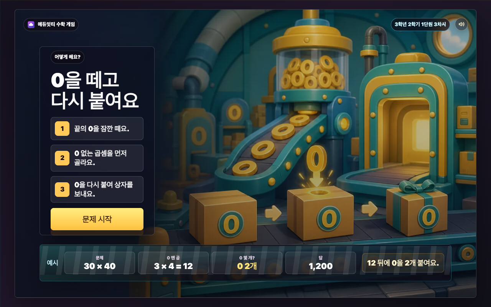
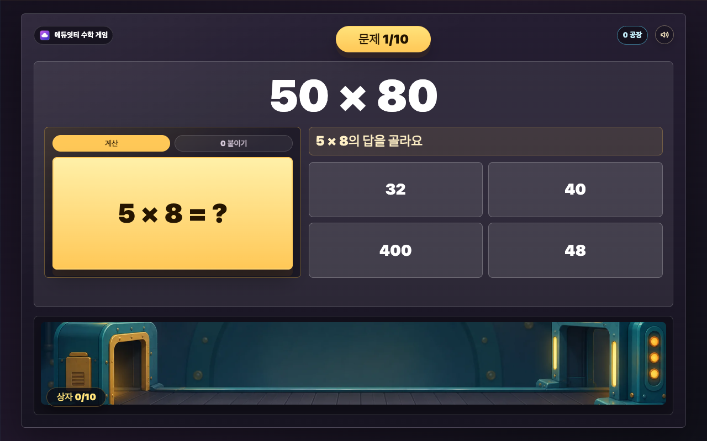
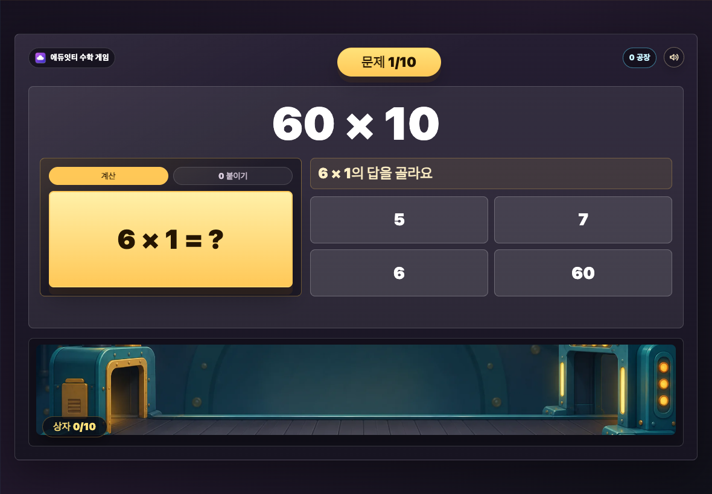

# 매스몬 0 공장 설명 보고서

## 1. 개요

`매스몬 0 공장`은 3학년 2학기 1단원 3차시에서 다루는 `(몇십)×(몇십), (몇십몇)×(몇십)` 계산을 짧은 게임 흐름으로 연습하는 수학 게임입니다. 학생은 곱셈 문제를 보고 0을 잠깐 떼어 낸 곱을 먼저 고른 뒤, 끝에 다시 붙일 0의 개수를 골라 답을 만듭니다.

핵심 목표는 `0 없는 곱셈을 먼저 한 뒤, 두 수 끝의 0 개수를 합쳐 답 뒤에 붙이는 원리`를 자연스럽게 반복하게 만드는 것입니다.

## 2. 학습 설계

- 문제 유형: `(A0)×(B0)`, `(AB)×(C0)`
- 문제 은행: 두 유형에서 매 판 5문제씩 섞어 총 10문제 출제
- 입력 방식: 1단계 0 뗀 곱 선택, 2단계 0 개수 선택
- 피드백: 첫 오답에는 짧은 힌트, 두 번째 오답에는 정답과 설명을 보여 준 뒤 다음 단계로 이동
- 대표 오개념 처리: 2단계 선택지에는 0을 한 개 적게 붙이거나 한 개 많이 붙이는 보기가 항상 들어감
- 보상: 한 문제 완료마다 상자 1칸이 채워지고 검사문 이벤트 1회가 적용됩니다. 정답 문제는 상자 출발, 빠른 벨트, 고쳐서 보냄, 문이 열림, 잠깐 멈춤, 무지개 상자 중 하나가 나오고, 오답이 있었던 문제는 고쳐서 보내는 상자로 표시합니다.
- 상자가 간 길: 내부 값에 따라 우리 반 -> 학교 -> 동네 -> 도시 -> 전국 -> 세계 배경이 열립니다. 이 값은 별도 보상이 아니라, 오늘 만든 상자를 설명하는 한 줄 이야기로만 씁니다.
- 특별 단계: 무지개 상자를 한 번 얻으면 우주 결과가 우선합니다.
- 최종 보상: 오늘 만든 상자 등급을 크게 공개합니다. 매스몬은 성과 등급과 무관한 작은 동행 캐릭터로만 둡니다.

## 3. 게임 흐름

```text
첫 화면 -> 설명 화면 -> 0 뗀 곱 선택 -> 0 개수 선택 -> 답 완성 -> 상자 검사문 통과 -> 다음 문제 또는 바로 결과 -> 상자 등급 공개
```

학생은 예를 들어 `30 × 40`에서 먼저 `3 × 4 = 12`를 고릅니다. 다음 단계에서 두 수 끝에 있던 0이 모두 2개였다는 것을 골라, 컨베이어 보드에 0 두 개가 붙고 `1,200`이 됩니다.

`27 × 40`에서는 `27 × 4 = 108`을 고른 뒤 0을 1개 붙여 `1,080`을 만듭니다. 이처럼 문제마다 통째 계산보다 `0 뗀 곱`과 `0 개수`가 먼저 보이도록 설계했습니다.

## 4. 화면별 설명

### 첫 화면

첫 화면은 `cover-generated.webp`를 RasterStage 배경으로 사용합니다. 0 공장과 컨베이어가 보이는 대표 장면 위에 GPT Image로 만든 독립 제목 로고(`title-logo-generated.webp`)를 얹고, 한 줄 목표와 시작 버튼은 HTML로 얹습니다. 제목 로고 원본은 `title-logo-chromakey.png`로 보관하고, 초록 배경 제거 PNG/WebP를 배포 자산으로 사용합니다.

### 설명 화면

설명 화면은 `tutorial-zero-flow-generated.webp`를 RasterStage 배경으로 사용합니다. 생성 이미지 안에는 한글이나 숫자를 굽지 않고, 0이 떨어졌다가 다시 붙고 닫힌 상자가 움직이는 흐름만 보여 줍니다. 정확한 설명과 예시는 HTML 오버레이로 얹어 철자 오류와 잘못된 수식이 화면에 남지 않게 했습니다.

설명 문구는 3단계만 보여 줍니다.

1. 끝의 0을 잠깐 떼요.
2. 0 없는 곱셈을 골라요.
3. 0을 다시 붙여 상자를 보내요.

버튼 문구는 다음 행동이 바로 보이도록 `문제 시작`으로 둡니다.

### 문제 화면

문제 화면은 큰 문제·현재 단계·한 줄 지시·선택지를 가장 크게 둡니다. 아래쪽 컨베이어는 평소에 조용히 보이고, 문제를 끝낸 뒤 상자가 이동할 때만 움직입니다.

상자 칸은 문제마다 1칸씩 채워집니다. 한 번에 맞힌 문제는 완성 상자로 남고, 중간에 틀린 문제는 고쳐서 보내는 상자로 남습니다.

### 보상 화면

한 문제의 두 단계가 끝나면 상자가 컨베이어 위를 지나 검사문 앞에서 잠깐 멈춥니다. 잠깐 기다린 뒤 `상자 출발`, `빠른 벨트`, `고쳐서 보냄`, `잠깐 멈춤`, `문이 열림`, `무지개 상자` 중 하나가 짧게 나옵니다. 문제 안에서 한 번이라도 틀리면 `고쳐서 보냄`이 적용됩니다.

보상 모달은 설명 문장을 없애고 현재 등급 상자 이미지와 한 줄 라벨만 보여 줍니다. 버튼은 다음 행동만 말하도록 `다음` 또는 `보기`로 둡니다.

### 결과 화면

결과 화면은 공장 장면 RasterStage 배경 위에 오늘 만든 상자와 정답 수를 HTML로 얹습니다. 상자가 간 길은 제목 아래 한 줄 이야기와 배경 장면으로만 보이고, 별도 보상 카드로 세우지 않습니다. 상자 등급은 종이·노란·튼튼·은빛·금빛·왕관·무지개 7단계입니다. 최고 단계는 높은 정답 수와 높은 내부 값이 함께 필요하고, 무지개 상자는 특별 이벤트가 있어야 나옵니다.

## 5. 매스몬 역할

3차시의 보상 주인공은 매스몬이 아니라 오늘 만든 상자입니다. 실행 화면에서는 냥냥몬을 고정 동행으로만 쓰며, 정답 수나 상자 등급에 따라 다른 매스몬이 나오지 않습니다.

현재 기준은 1차시 `매스몬 상자런`의 밝은 2D 애니/스티커형 매스몬 톤입니다. 3차시 전용 팩은 톱니바퀴나 컨베이어 같은 사물형 매스몬이 아니라, 동물/판타지 생물을 본체로 삼습니다. 0 공장 느낌은 작업모, 0 스티커, 배지 같은 소품으로만 더했습니다. 원본 관리는 `_shared/mathmon/zero-factory-animal-pack/`에서 하고, 3차시 실행 패키지에는 필요한 WebP만 복사했습니다. 기존 0 공장팩과 V2 장난감/클레이풍 팩은 보존만 하고 실행에는 쓰지 않습니다.

상자 보상 자산은 `_shared/mathmon/zero-factory-animal-pack/toybox/`에서 관리합니다. 실행 기준 구성은 상자 등급 7종, 검사문, 하단 컨베이어 무대, 이벤트 오버레이입니다. 캐릭터가 보이는 초기 toybox 시안은 보존만 하고 실행 패키지에는 복사하지 않습니다.

## 6. 최신 스크린샷

아래 스크린샷은 최신 화면 기준으로 갱신했습니다.

- 첫 화면: 
- 설명 화면: 
- 문제 화면: 
- 보상 화면: 
- 결과 화면: 
- 다시하기 결과: 
- 태블릿 첫 화면: 
- 태블릿 문제 화면: 

## 7. 공개 패키지 구성

이 폴더는 별도 빌드 없이 바로 열 수 있는 정적 패키지입니다.

- `index.html`
- `cover-generated.webp`
- `title-logo-generated.webp`
- `tutorial-zero-flow-generated.webp`
- `factory-conveyor-generated.webp`
- `zero-token-generated.webp`
- `result-class-generated.webp`
- `result-school-generated.webp`
- `result-town-generated.webp`
- `result-city-generated.webp`
- `result-country-generated.webp`
- `result-world-generated.webp`
- `result-space-generated.webp`
- `result-retry-generated.webp`
- `eduitit-logo-mark.png`
- `assets/mathmon/zero-factory-animal-pack/mathmon-zfa-04-nyangnyangmon.webp`
- `assets/toybox/*.webp`
- `screenshots/*.png`
- `README.md`

브라우저에서 `index.html`을 열면 바로 실행됩니다.
