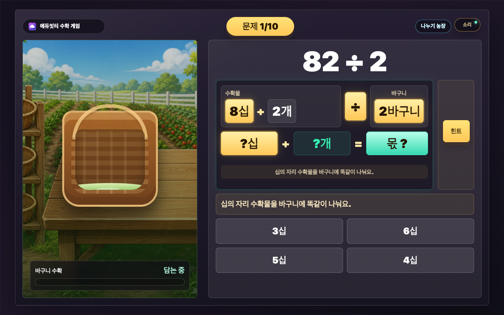

# 매스몬 나누기 농장 설명 보고서

## 1. 개요

`매스몬 나누기 농장`은 3학년 2학기 2단원 나눗셈 첫 차시에서 다루는 내림 없는 `(몇십몇) ÷ (몇)` 계산을 게임 흐름으로 연습하는 에듀잇티 수학 게임입니다. 학생은 십의 자리 수확물을 먼저 나누고, 일의 자리 수확물을 나눈 뒤, 두 자리 몫을 합쳐 바구니에 담습니다.

핵심 목표는 `십의 자리와 일의 자리를 각각 나누어 몫을 완성하는 과정`을 자연스럽게 반복하게 만드는 것입니다.

## 2. 학습 설계

- 문제 유형: 내림과 나머지가 없는 `(몇십몇) ÷ (몇)`
- 문제 은행: 두 자리 피제수 20~99 중 십의 자리와 일의 자리가 나누는 수로 각각 나누어떨어지는 후보에서 나누는 수가 고르게 섞이도록 10문제 추출
- 입력 방식: 십의 자리 몫 -> 일의 자리 몫 -> 최종 몫 3단계 4지선다 선택
- 대표 오답: `몫 합치기` 단계마다 자리값을 무시해 십의 자리 몫과 일의 자리 몫을 더한 선택지를 반드시 포함
- 피드백: 첫 오답은 힌트, 두 번째 오답은 정답과 설명 공개 후 다음 단계 진행
- 보상: 문제 완료마다 수확 이벤트 1회 적용. 오답이 있었던 문제는 벌레 먹음으로 처리
- 결과 등급: 수확 점수와 정답 수 게이트를 함께 보아 씨앗, 새싹, 텃밭, 농장, 대농장 중 하나를 보여 줌
- 특수 등급: 황금 작물 이벤트를 얻으면 전설 황금밭 결과를 우선 보여 줌

## 3. 게임 흐름

```text
첫 화면 -> 설명 화면 -> 십의 자리 나누기 -> 일의 자리 나누기 -> 몫 합치기 -> 수확 이벤트 -> 다음 문제 또는 결과 -> 수확 등급 결과
```

예를 들어 `82 ÷ 2`가 나오면 학생은 먼저 `8십 ÷ 2 = 4십`을 고릅니다. 다음에는 `2 ÷ 2 = 1`을 고르고, 마지막에 `4십 + 1 = 41`을 골라 몫을 완성합니다.

## 4. 화면별 설명

### 첫 화면

첫 화면은 `cover-generated.webp`를 RasterStage 배경으로 사용합니다. 게임 제목, 한 줄 목표, 시작 버튼, 브랜드 배지, 단원 배지는 HTML 오버레이입니다.


### 설명 화면

설명 화면은 `tutorial-generated.webp`를 배경으로 사용합니다. 학생에게는 3단계만 보여 줍니다.

1. 십의 자리 수확물을 먼저 나눠요.
2. 일의 자리 수확물도 똑같이 나눠요.
3. 몫을 합치면 바구니에 수확이 담겨요.


### 문제 화면

문제 화면은 왼쪽에 수확 바구니, 오른쪽에 나눗셈 나눠 담기 판과 선택지를 둡니다. 계산판은 `수확물`, `바구니`, `몫`을 한 줄 흐름으로 보여 주며, 빈 받아올림 칸이나 곱셈 세로셈 모양은 쓰지 않습니다. 문제와 선택지가 가장 크게 보이며, 수확 점수와 보상은 보조 정보로만 표시됩니다.



### 보상 화면

한 문제의 3단계를 끝내면 수확 이벤트 모달이 뜹니다. `reward-events-sprite-generated.png`의 6개 이미지 칸을 사용하며, HTML로 `수확 +8`, `수확 -5`, `수확 0`, `대풍!`, `황금!` 같은 짧은 결과만 얹습니다.


### 결과 화면

결과 화면은 도달한 수확 등급 이미지를 배경으로 사용합니다. 수확 점수, 정답 수, 등급명, 칭찬 문구, 다시하기 버튼은 HTML 오버레이입니다. 결과는 차시 자체 완결형 등급으로 끝나며 도감이나 누적 보관 구조는 만들지 않았습니다.


## 5. 검증

- `index.html` 내부 스크립트 구문 점검: 통과
- 이미지 참조 누락 점검: 누락 없음
- Chrome headless CDP 흐름 검증: 커버 -> 설명 -> 문제 -> 보상 -> 결과 통과
- 표본 문제 확인: 후보 48개 모두 십의 자리와 일의 자리가 각각 나누어떨어지고, 몫이 `십의 자리 몫 * 10 + 일의 자리 몫`으로 계산됨
- 100라운드 샘플링 확인: 한 판 10문제, 한 판 내 중복 없음, 최소 8종의 나누는 수 포함
- 선택지 확인: 48개 후보의 `몫 합치기` 단계에서 `십의 자리 몫 + 일의 자리 몫` 오답 누락 0건
- 오답 공개 확인: 십의 자리 단계에서 `정답은 4십이에요`처럼 단위가 붙어 표시됨
- 화면 계약 확인: 첫 화면 3요소, 브랜드/단원/배움주제 배지, 중심 보상 1개, 결과 등급 구조 유지

브라우저에서 `index.html`을 열면 바로 실행됩니다.
