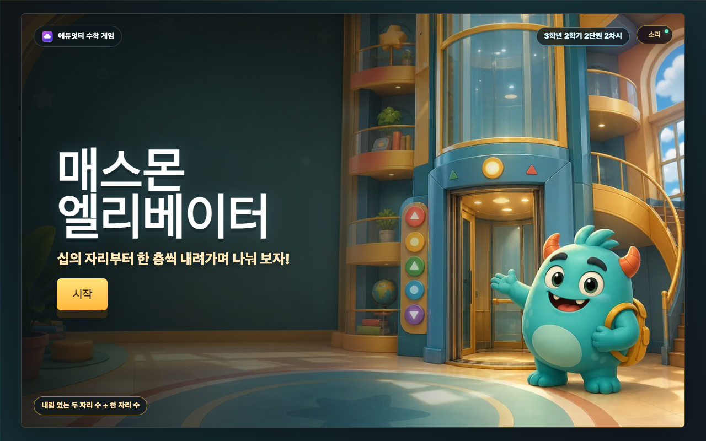
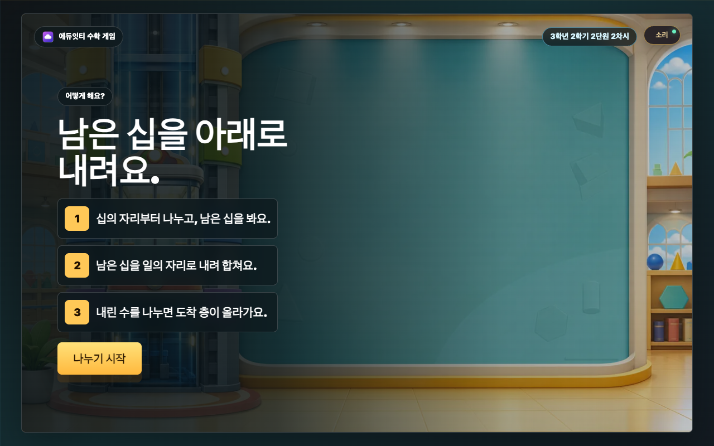
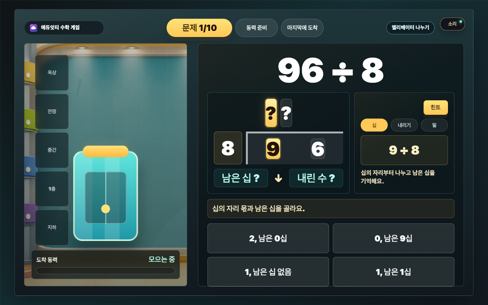
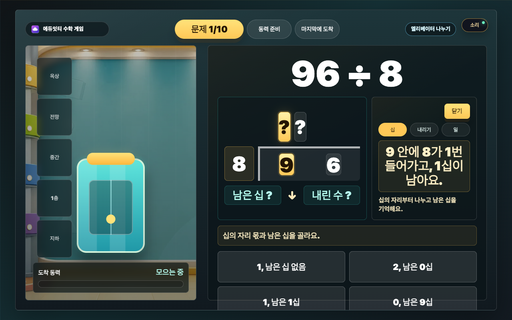
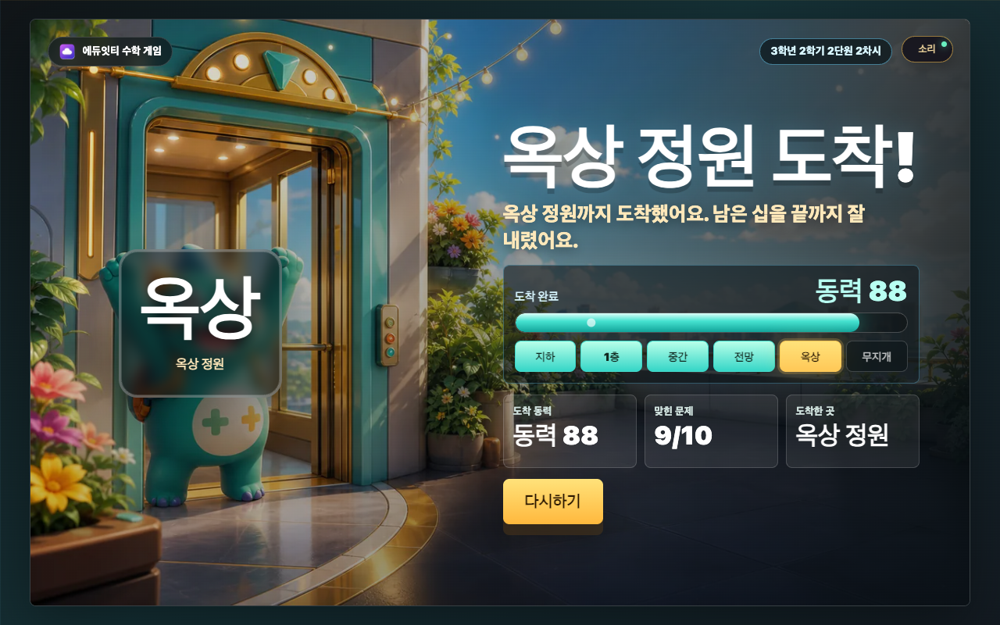
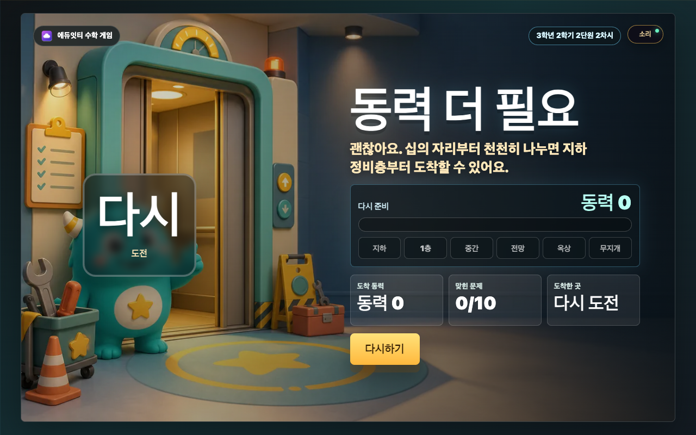
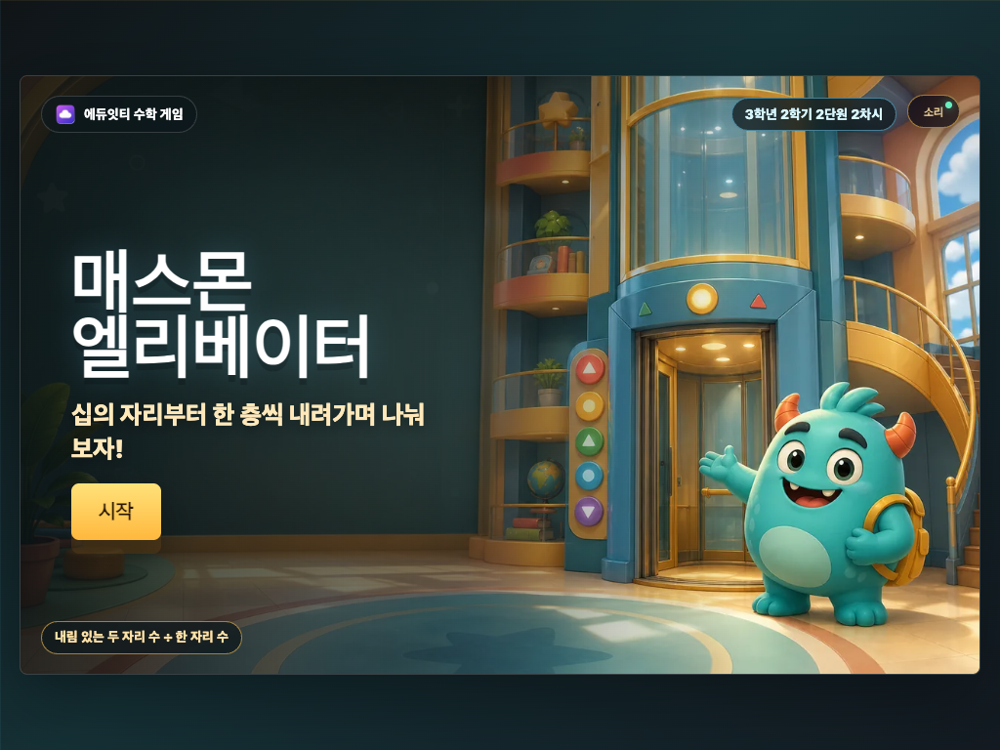

# 매스몬 엘리베이터 설명 보고서

## 1. 개요

`매스몬 엘리베이터`는 3학년 2학기 2단원 2차시에서 다루는 내림 있는 (두 자리)÷(한 자리) 계산을 게임 흐름으로 연습하는 에듀잇티 수학 게임입니다. 학생은 십의 자리부터 나누고, 남은 십을 일의 자리로 내려 합친 뒤, 일의 자리 몫을 찾아 최종 몫을 완성합니다.

핵심 목표는 `남은 십을 아래로 내려 다시 나누는 과정`을 눈에 보이는 엘리베이터 행동으로 반복하게 만드는 것입니다.

## 2. 학습 설계

- 문제 유형: 내림 있는 (두 자리)÷(한 자리), 나머지 0
- 문제 은행: 나누는 수 2~8, 몫 두 자리, 십의 자리에서 남은 십이 생기는 문제만 필터링
- 라운드 길이: 10문제
- 입력 방식: 십의 자리, 내리기, 일의 자리 3단계 4지선다 선택
- 1단계: 십의 자리 몫과 남은 십을 고름
- 2단계: 남은 십을 일의 자리로 내려 합친 수를 고름
- 3단계: 내린 수를 나누어 일의 자리 몫을 고르고 최종 몫 자동 완성
- 대표 오답: 남은 십을 빠뜨리고 일의 자리만 나누는 선택지
- 보상: 한 문제 완료마다 엘리베이터 동력 이벤트를 1회 적용. 정답 문제는 가속 모터, 정전, 슈퍼 모터, 급행 운행, 멈춤, 무지개 동력 중 하나가 나오고, 오답이 있었던 문제는 정전 처리만 적용
- 결과 등급: 동력과 정답 수 게이트를 함께 사용해 도착 층을 공개
- 비밀 등급: 무지개 동력을 얻으면 정답 수와 관계없이 꼭대기 전망대가 열림
- 최종 보상: 도착 층 자체가 보상이며, 매스몬 도감 수집 구조는 사용하지 않음

### 교육적 의도

내림 있는 나눗셈은 십의 자리에서 남은 수를 일의 자리와 합쳐야 하는데, 학생은 종종 남은 십을 버리고 일의 자리만 나누려 합니다. 이 게임은 `52 ÷ 4`를 `5 ÷ 4`, `1십 + 2 = 12`, `12 ÷ 4`로 쪼개 보여 줍니다.

특히 2단계 선택지에 `일의 자리만 2` 같은 오답을 항상 넣어, 내림 빠뜨림을 계산 과정 안에서 직접 비교하게 했습니다.

## 3. 게임 흐름

```text
첫 화면 -> 설명 화면 -> 십의 자리 나누기 -> 남은 십 내리기 -> 일의 자리 나누기 -> 동력 이벤트 -> 다음 문제 또는 급행 운행 -> 동력 측정 -> 도착 층 결과
```

학생은 먼저 십의 자리 몫과 남은 십을 고릅니다. 다음에는 남은 십을 일의 자리로 내려 합친 수를 고르고, 마지막으로 그 수를 나누어 최종 몫을 완성합니다.

## 4. 화면별 설명

### 첫 화면

첫 화면은 `cover-generated.webp`를 RasterStage 배경으로 사용합니다. 엘리베이터와 매스몬 장면 위에 게임 제목, 한 줄 목표, 시작 버튼을 HTML로 얹습니다. 생성 이미지에는 텍스트를 넣지 않아 제목과 버튼이 선명하게 유지됩니다.

### 설명 화면

설명 화면은 3단계만 보여 줍니다.

1. 십의 자리부터 나누고, 남은 십을 봐요.
2. 남은 십을 일의 자리로 내려 합쳐요.
3. 내린 수를 나누면 도착 층이 올라가요.

버튼 문구는 다음 행동이 바로 보이도록 `나누기 시작`으로 두었습니다.

### 문제 화면

문제 화면은 왼쪽에 엘리베이터 샤프트와 동력 상태, 오른쪽에 문제와 나눗셈 보드, 선택지를 둡니다. 문제와 선택지가 가장 크게 보이도록 엘리베이터 샤프트는 보조 시각 요소로 제한했습니다.

나눗셈 보드는 몫 두 자리, 나누는 수, 나누어지는 수, 남은 십, 내린 수를 보여 줍니다. 각 단계가 끝나면 해당 칸이 채워지고, 마지막 단계에서는 최종 몫이 완성됩니다.

### 보상 화면

한 문제의 3단계 계산이 끝나면 화면 중앙에 엘리베이터 동력 이벤트가 뜹니다. 정답 문제는 가속 모터, 슈퍼 모터, 정전, 급행 운행, 멈춤, 무지개 동력 중 하나가 나오며, 문제 안에서 한 번이라도 틀리면 정전 처리만 적용됩니다. 보상 이미지는 `reward-events-sprite-generated.png`의 3×2 스프라이트에서 이벤트별 칸을 골라 보여 줍니다. 보상은 엘리베이터 동력 하나로만 적용됩니다.

### 결과 화면

결과 화면은 도착 층별 RasterStage 배경을 동적으로 교체합니다. `result-basement-generated.webp`, `result-first-generated.webp`, `result-middle-generated.webp`, `result-view-generated.webp`, `result-roof-generated.webp`, `result-rainbow-generated.webp`, `result-retry-generated.webp`를 사용하고, 그 위에 동력 측정 막대, 정답 수, 도착 층, 칭찬 문구, 다시하기 버튼을 HTML로 얹습니다.

도착 층은 지하 정비층, 1층 로비, 중간층, 전망층, 옥상 정원, 꼭대기 전망대로 구분됩니다. 일반 층은 동력만으로 쉽게 열리지 않도록 정답 수 게이트를 함께 사용합니다. 무지개 동력은 특별 보상으로, 정답 수가 낮아도 꼭대기 전망대에 바로 도착합니다. 실패 결과는 축하 무대가 아니라 다시 준비하는 안전한 장면으로 분리했습니다.

## 5. 검증 스크린샷











## 6. 매스몬 역할

매스몬은 첫 화면과 결과 화면에서 엘리베이터 모험을 함께하는 동행 캐릭터로 등장합니다. 학생이 얻는 중심 보상은 `엘리베이터 도착 층`이며, 도감 수집 구조는 사용하지 않습니다.

## 7. 공개 패키지 구성

이 폴더는 별도 빌드 없이 바로 열 수 있는 정적 패키지입니다. 학생용 static 사본에는 실행에 필요한 파일만 복사하고, PNG 원본과 스크린샷은 작업실에 보관합니다.

- `index.html`
- `cover-generated.webp`
- `board-shaft-generated.webp`
- `reward-events-sprite-generated.png`
- `result-basement-generated.webp`
- `result-first-generated.webp`
- `result-middle-generated.webp`
- `result-view-generated.webp`
- `result-roof-generated.webp`
- `result-rainbow-generated.webp`
- `result-retry-generated.webp`
- `eduitit-logo-mark.png`
- `README.md`
- `REPORT.md`

작업실 보관물:

- `*-generated.png`: 생성 이미지 원본
- `screenshots/*.png`: 화면 검증 스크린샷
